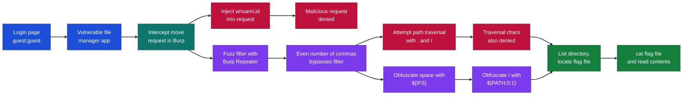
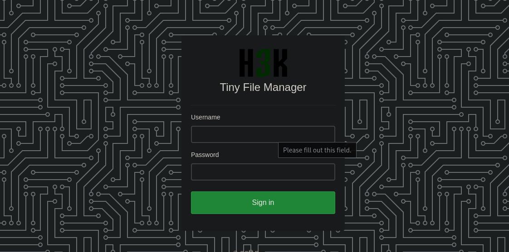
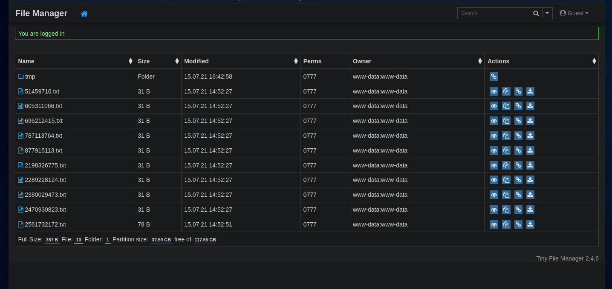
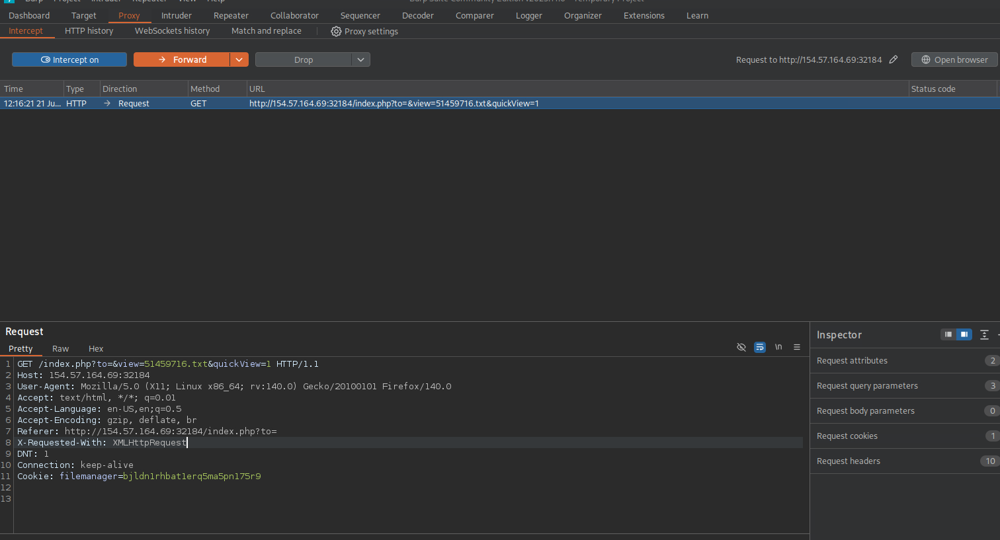
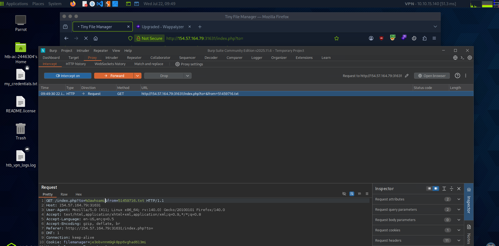
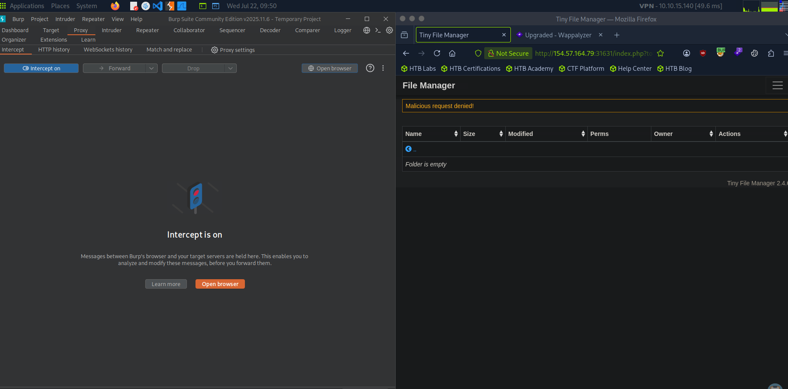
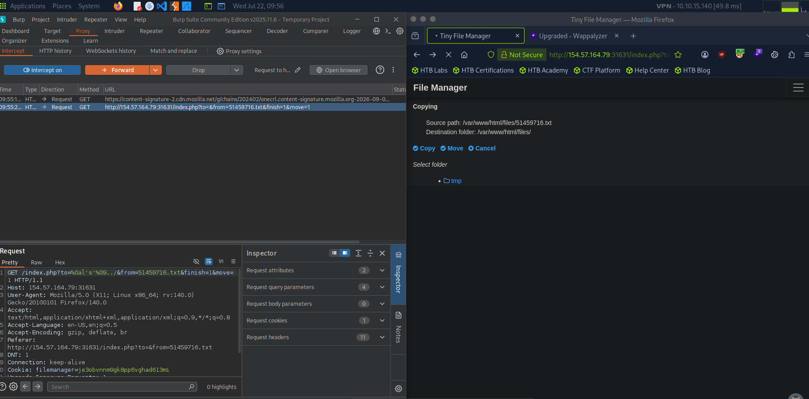
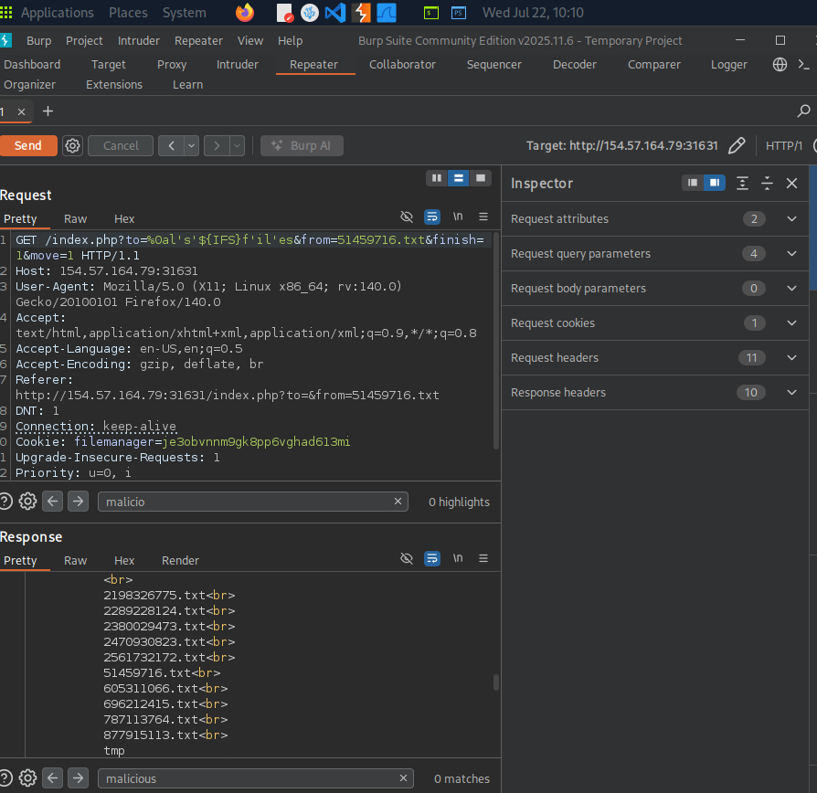
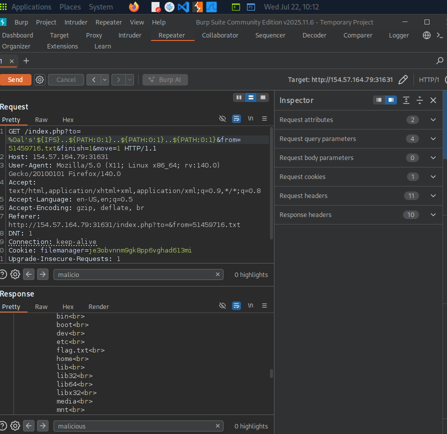
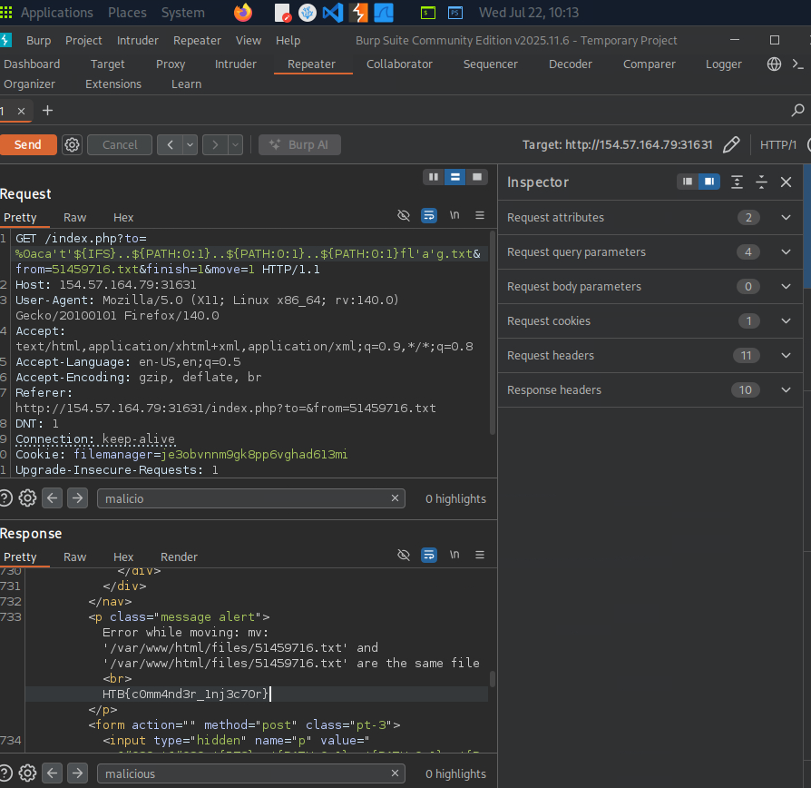

# Hack The Box Academy - Command Injection Skills Assessment | Write-up

> **Platform:** Hack The Box Academy &nbsp;•&nbsp; **Category:** Web Attacks / Command Injection &nbsp;•&nbsp; **Difficulty:** Easy
>
> **Author:** Jithin Jelson

---

## Introduction

This is a command injection assessment from Hack The Box Academy labs, where we are given the task of performing a penetration test for a company. In our penetration test we come across an interesting file manager web application. Since file managers tend to execute system commands, we are interested in testing for command injection vulnerabilities.

Our task is to use various techniques to detect a command injection vulnerability and then exploit it, evading any filters that have been placed.

---

## Assessment Overview



---

## What I Learned

- That `%0a` was not blacklisted but `whoami,id` was, so the filter was blocking on specific command content rather than the newline.
- Using an even amount of commas was enough to break the application and get past the filter.
- `${IFS}` can stand in for a space when the space character is being blocked.
- `${PATH:0:1}` gives me a `/` character when the literal `.` and `/` are denied, which let me keep doing path traversal.

---

## Finding the vulnerable application

> Target IP address: `154.57.164.69:32184`
> Credentials: username `guest`, password `guest`

First we can start by visiting the web application port. An Nmap scan is not necessary in this scenario as we have been told exactly what to test for.

When we arrive at the page we are greeted with a login page in which we can enter the credentials provided to us by the assessment.


*Figure 1 - Login page for the file manager application*

When we sign in we come across the vulnerable file manager application.


*Figure 2 - File manager application after logging in*

---

## Intercepting the move request in Burp Suite

Since we found our target page we can boot up Burp Suite.

When we tried to intercept one of the move requests we can see the following has been caught by Burp Suite.


*Figure 3 - Burp Suite intercepting a file move request*

I tried to intercept the GET request here with a tab character and the `whoami` command, followed by various other characters, but it seemed I had no luck, so I decided to move on. At this point I was quite stuck, as I had tried a couple of the file managing tools to test for command injection but had no luck with any of them. I even tried the search bar but didn't have any luck, so at this point I reached out to AI for help, and managed to find something interesting when I intercepted a request to move a file and inserted a command injection.


*Figure 4 - Intercepted move request with an injected command*

We received a notification that says malicious request denied.


*Figure 5 - "Malicious request denied" response from the application*

---

## Bypassing the filter with Burp Repeater

It seems that we have found our vulnerable point, but we just had to find the right command, so to do this we send our Burp GET request to Repeater to try different payloads.

Luckily, on my second attempt I found out that just by using an even amount of commas I was able to break the application. The `%0a` was not blacklisted, but the command `whoami,id` was, so by changing this I was able to bypass the rules set in place.

---

## Locating the flag with path traversal

The next step was to find where the flag is, so we can use the `ls` and `cd` commands as required to navigate to our flag.

However, it seems we ran into more problems. I wanted to view the directory files, but it seems that there are malicious characters still being denied.


*Figure 6 - Path traversal characters being blocked by the filter*

My guess is that it is the characters `.` and `/`.

We can use manual obfuscation here, as it is not too overly complex at this point. I decided to use the Linux environment variable to get me a space, `${IFS}`.


*Figure 7 - Directory listing after bypassing the filter with `${IFS}`*

It seemed however there was nothing interesting in the files directory, so we can now go back a directory to see where the flag file is.

We finally got it after doing quite a bit of path traversal.


*Figure 8 - Locating the flag file after path traversal*

The final command for the location of the flag is:

```
GET /index.php?to=%0al's'${IFS}..${PATH:0:1}..${PATH:0:1}..${PATH:0:1}&from=51459716.txt&finish=1&move=1 HTTP/1.1
```

Now we just have to `cat` the file and we can get its content.


*Figure 9 - Flag file contents after running `cat`*

---
