# Hack The Box - Headless | Write-up

> **Platform:** Hack The Box &nbsp;•&nbsp; **Category:** Linux &nbsp;•&nbsp; **Difficulty:** Easy
>
> **Author:** Jithin Jelson

---

## Introduction

Headless is a fairly straightforward Linux box in which a customer support form is found to be vulnerable to cross site scripting via the Accept-Encoding header. This vulnerability can then be leveraged to steal an admin cookie, which is then used to access the administrator dashboard. The admin dashboard is vulnerable to command injection, leading to a reverse shell on the box. Then we enumerate the user's mail which reveals a script that does not use absolute paths, which is then used to get a shell as root.

---

## Assessment Overview


```mermaid
flowchart LR
    A["Nmap<br/>22 SSH<br/>5000 HTTP"] --> B["ffuf<br/>/support<br/>/dashboard"]
    B --> C["Accept-Encoding<br/>XSS"]
    C --> D["Blind XSS<br/>cookie stealer"]
    D --> E["Steal admin<br/>cookie"]
    E --> F["Administrator<br/>Dashboard"]
    F --> G["Command<br/>injection"]
    G --> H["user.txt"]
    G --> I["Reverse shell<br/>as dvir"]
    I --> J["sudo -l<br/>/usr/bin/syscheck"]
    J --> K["Relative path<br/>./initdb.sh"]
    K --> L["root.txt"]

    classDef entry fill:#1d4ed8,stroke:#1e3a8a,color:#ffffff;
    classDef recon fill:#0f766e,stroke:#134e4a,color:#ffffff;
    classDef xss fill:#7c3aed,stroke:#5b21b6,color:#ffffff;
    classDef access fill:#b45309,stroke:#78350f,color:#ffffff;
    classDef exploit fill:#be123c,stroke:#881337,color:#ffffff;
    classDef root fill:#15803d,stroke:#14532d,color:#ffffff;

    class A entry;
    class B recon;
    class C,D xss;
    class E,F access;
    class G,H,I exploit;
    class J,K exploit;
    class L root;
    linkStyle default stroke-width:2px
```

---

## What I Learned

- That any data the server reflects back into a page can be an XSS sink, not just what is typed into form fields.
- How to carry out a blind XSS through an HTTP header and use it to steal an administrator's cookie.
- How to find and exploit command injection on a web dashboard to read files and land a reverse shell.
- How to escalate privileges by abusing a root script that calls a file with a relative path instead of an absolute one.
- That I should spawn an interactive shell straight away after catching a reverse shell, because I wasted a lot of time on a shell that was not working properly this time round.

---

## Enumeration

We first start a ping test to our target to see if it is up and alive. Now that we know our target is reachable we conducted an Nmap scan and found two ports that were available.

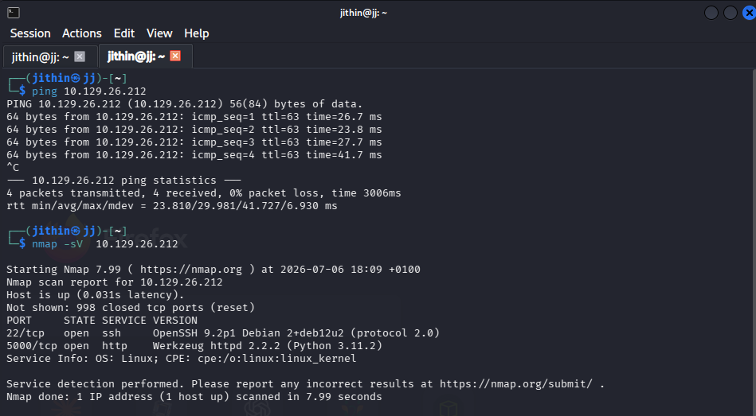
*Figure 1 - Nmap finds SSH on port 22 and a Werkzeug HTTP server on port 5000.*

Since a HTTP port is available on port 5000, it most likely has a web interface so we navigated towards there.

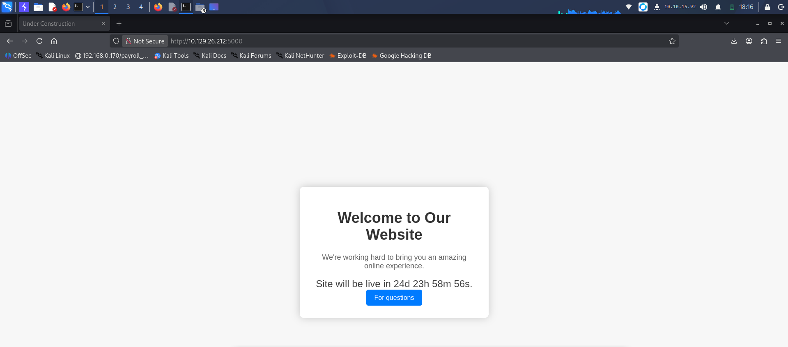
*Figure 2 - The site on port 5000 shows an "under construction" landing page.*

We are greeted with this page which doesn't seem to have much useful info other than a button that allows us to ask questions.

---

## Directory Fuzzing

The next step was to enumerate our endpoint. I usually use feroxbuster as it is quicker but today I decided to use ffuf. We came across two directories, dashboard and support.

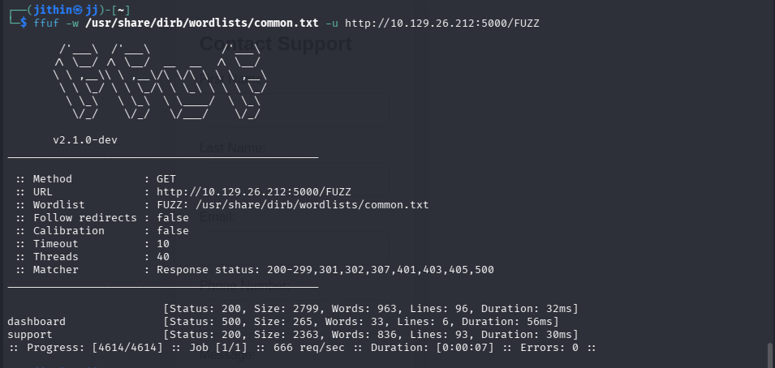
*Figure 3 - ffuf discovers the /dashboard and /support directories.*

When we headed to the support directory we get shown a contact support page in which we can ask questions. This seemed to be an interesting finding and the first thing on my mind was whether there was an XSS vulnerability.

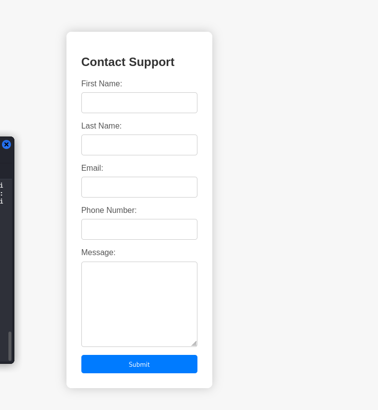
*Figure 4 - The contact support form at /support.*

However before testing it out for XSS we decided to visit the other directory as well.

Unfortunately we were not authorised to access the dashboard, most likely only for root or admin access.

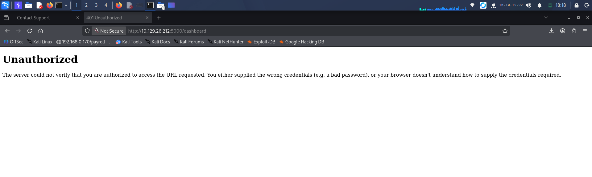
*Figure 5 - The /dashboard directory returns a 401 Unauthorized.*

Since our only real lead was the dashboard and it could not be enumerated any further, we decided to put in dummy data to see what sort of response we could get.

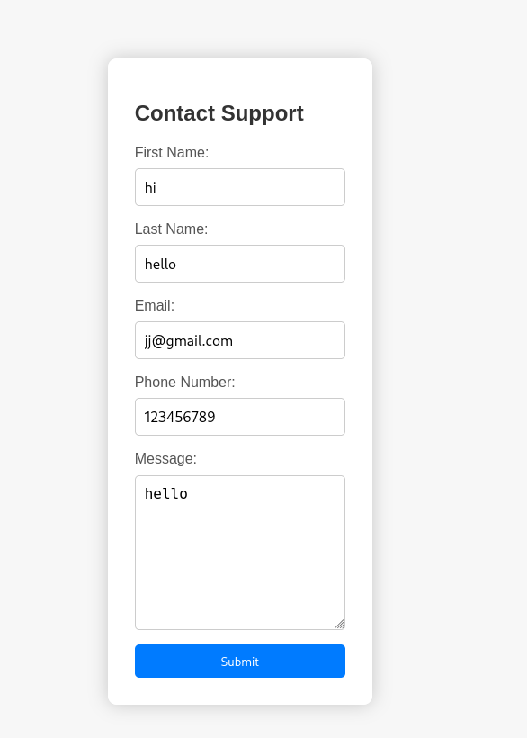
*Figure 6 - Submitting dummy values into the support form.*

However it seemed that the page just submitted our information and cleared all the fields for us.

---

## Finding the XSS

My first idea was to test for reflected XSS and identify the vulnerable field using the following data.

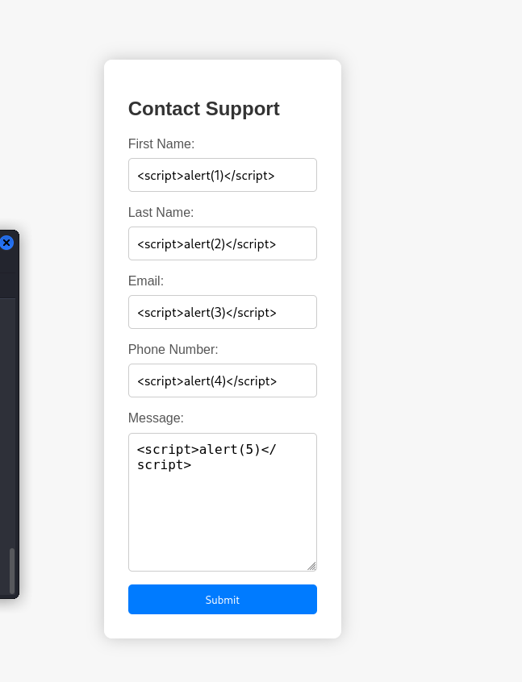
*Figure 7 - Placing a distinct script alert in each input field.*

However when we entered this we got a response that indicated that hacking was detected.

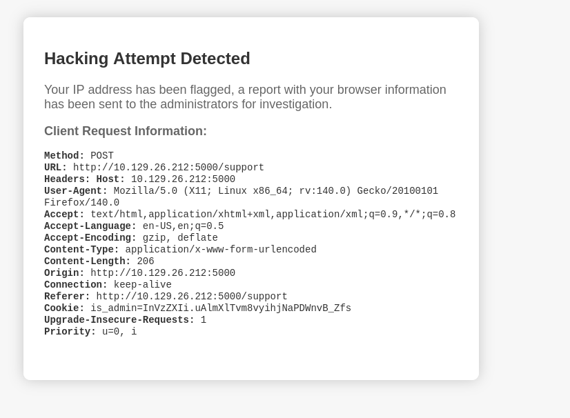
*Figure 8 - The "Hacking Attempt Detected" page, which also echoes back the full client request information.*

This was very interesting as the clue had told us that our IP with a report has been sent forward to the administrator for investigation, so this means that most likely the attack we will be conducting is a session hijacking attack to steal the administrator's cookie data and login on the unauthorised page.

So I decided to start up my listener on netcat and send a blind XSS injection to each field to find a vulnerable input, however my netcat came out empty and it seemed that none of the fields were actually vulnerable.

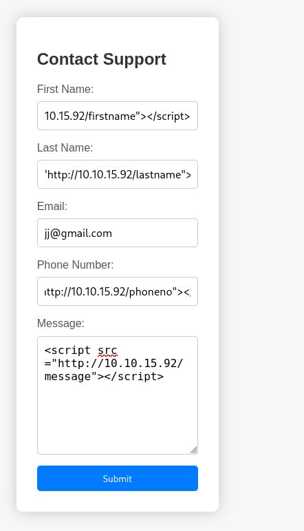
*Figure 9 - Blind XSS payloads placed in each form field, none of which fired.*

At this point I was really stuck because all the previous XSS attacks I had done used an input field as an attack so I didn't know where else my attack could even be placed.

However after doing a bit of research and looking through ippsec's videos for help I found out that any data that the server reflects back into a page can be an XSS sink and not just what is typed into forms, so I fired up Burp Suite and captured my POST request. I then edited the Accept-Encoding header with a script alert and we got a success, the Accept-Encoding field was vulnerable to an injection.

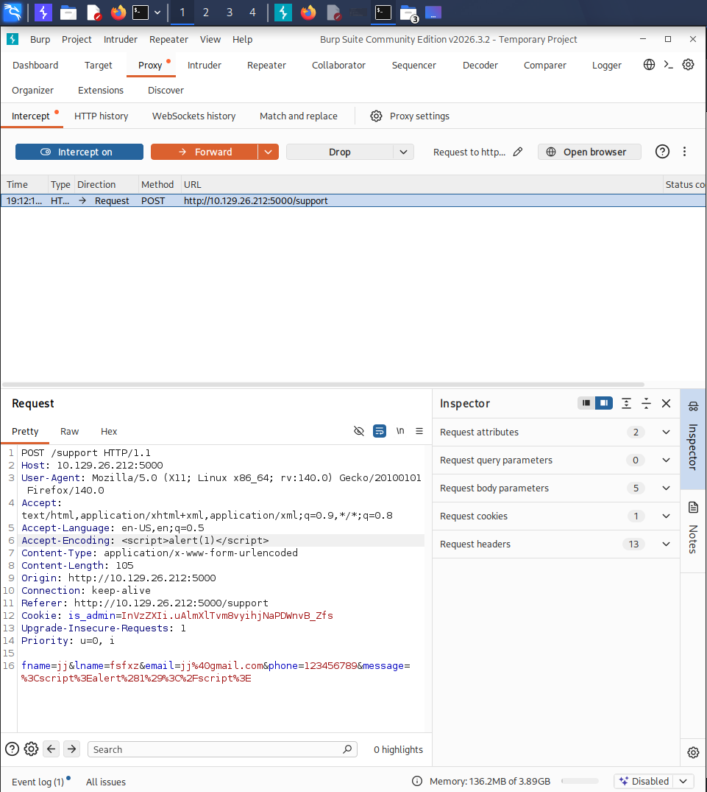
*Figure 10 - Injecting a script alert into the Accept-Encoding header in Burp Suite.*

---

## XSS via the Accept-Encoding Header

After the alert we once again got the "hacking warning message". So now that we have our vulnerable field we used Burp Suite to carry out a blind XSS on the same field to see if we could get a response.

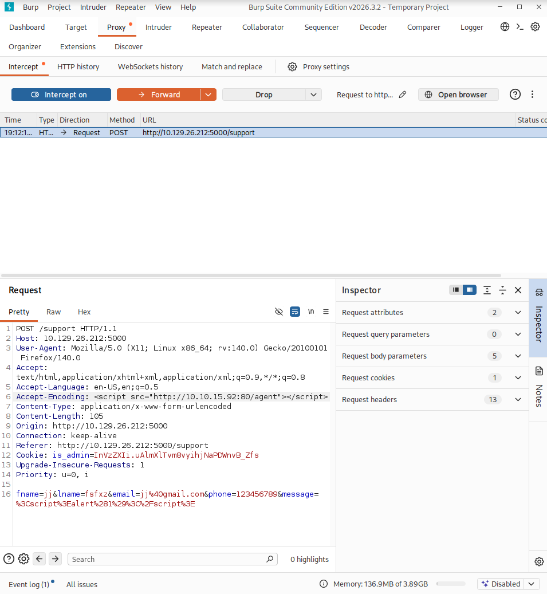
*Figure 11 - Loading a remote script through the Accept-Encoding header.*

And just like that we got a response.

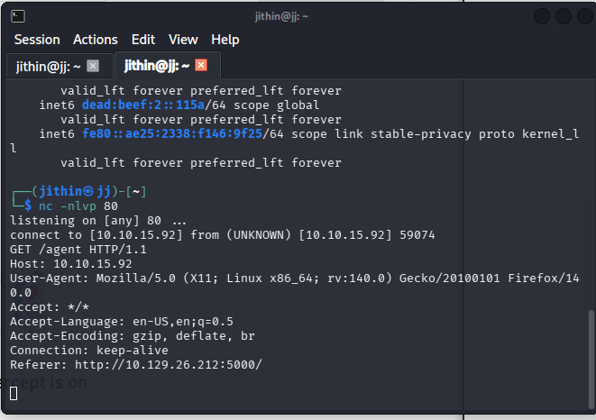
*Figure 12 - The admin browser requests our hosted script, confirming the blind XSS fires.*

---

## Stealing the Admin Cookie

Our next step is to create a script that will steal our cookies and inject this into the Accept-Encoding header, so we created our script.

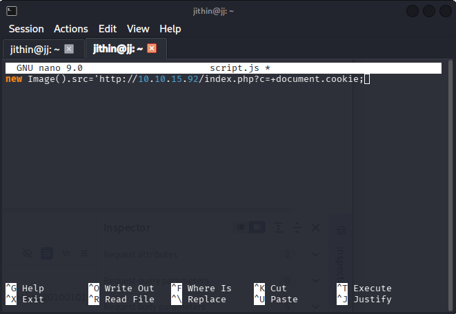
*Figure 13 - The cookie stealing script that sends document.cookie back to us.*

And started our PHP server, as netcat does not have enough capabilities in this instance.

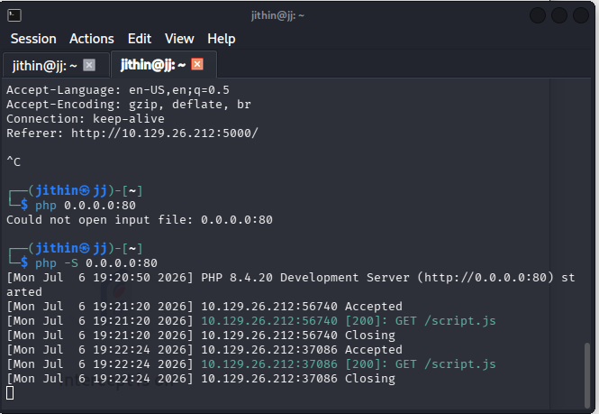
*Figure 14 - Hosting the payload with a PHP development server.*

Initially the script didn't execute, so I did a bit of troubleshooting and found out that I was missing a comma in my script for it to execute, and the second time round we got our cookie.

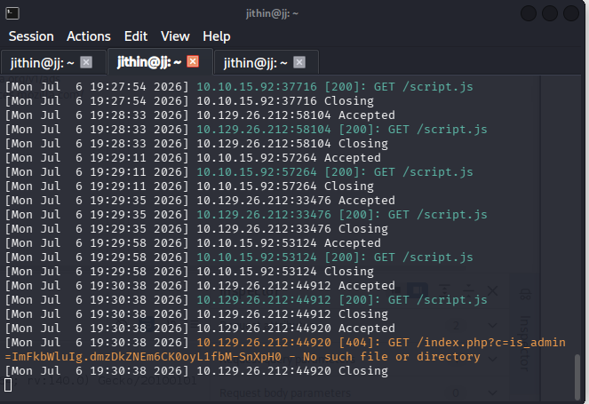
*Figure 15 - The administrator's is_admin cookie is captured in the server log.*

Now using our newly stolen cookie we went onto our dashboard and then replaced our cookie value using storage in developer tools.

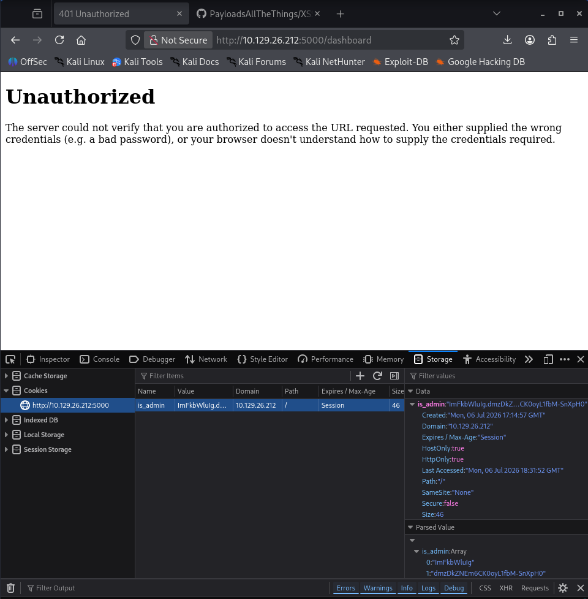
*Figure 16 - Swapping in the stolen is_admin cookie via the browser storage tab.*

And when we refreshed the page we got access to the admin dashboard.

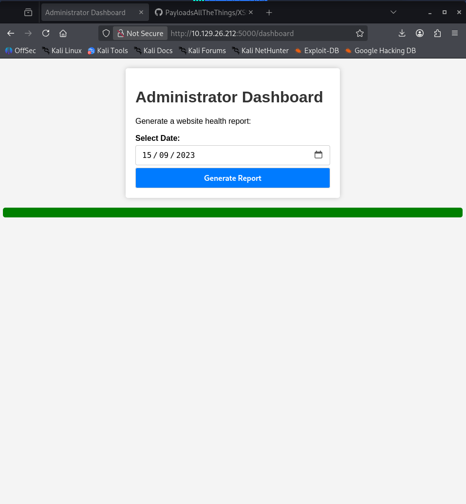
*Figure 17 - Access granted to the Administrator Dashboard.*

---

## Command Injection and User Flag

We then tried to see what else we can get from this page but it seemed like it was just the report and it didn't get any files from the report nor did it give anything useful.

So I fired open Burp Suite to see what else can be found. After quite a bit of playing around I found that after the date time we can insert a command injection that would give us information. We entered id and found the following.

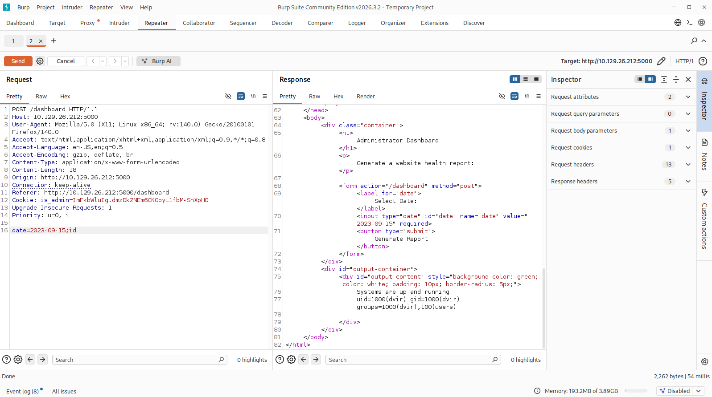
*Figure 18 - Appending ;id to the date parameter runs as the dvir user.*

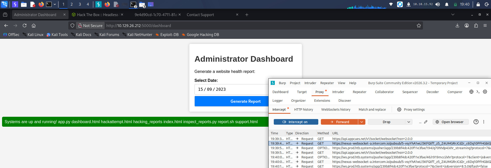
*Figure 19 - Listing the application files through the same injection.*

After using ls in different directories with URL encoding we found a user.txt and we got our first flag.

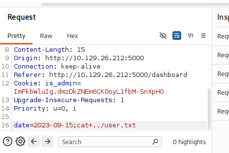
*Figure 20 - Reading user.txt through the command injection.*

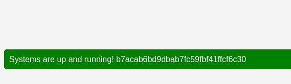
*Figure 21 - The user flag is returned in the report output.*

**Answer:** `b7acab6bd9dbab7fc59fbf41ffcf6c30`

---

## Reverse Shell

We then tried to access root, but we could not go into the folder, so we have to do some manual privilege escalation it seems.

So using command injection I fired a reverse shell and captured it on my netcat listener.

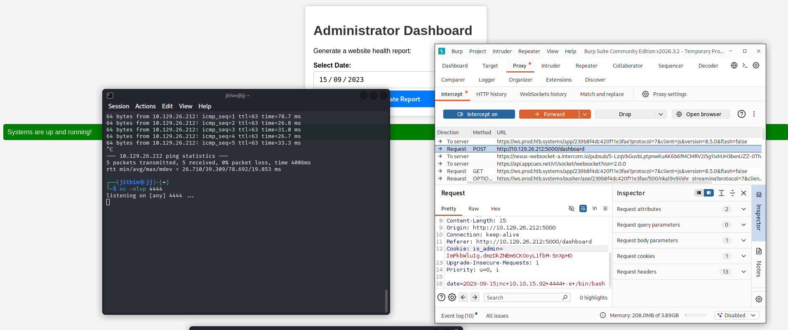
*Figure 22 - Catching a reverse shell as dvir on the netcat listener.*

I then tried to see if there was any password in /etc/shadow or interesting information in /etc/passwd but both didn't seem to load, so I used sudo -l to see what commands I can run.

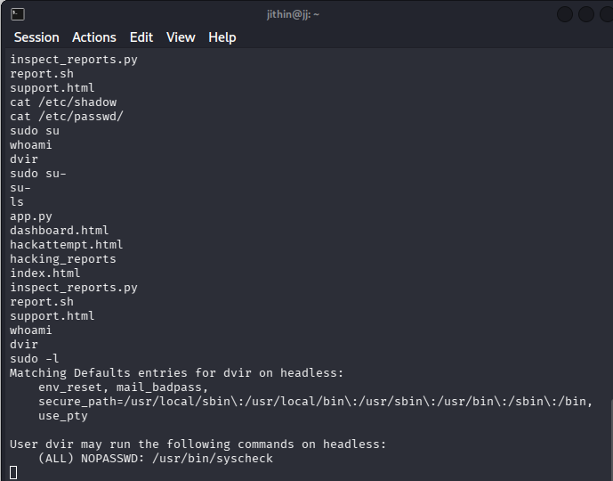
*Figure 23 - sudo -l reveals dvir can run /usr/bin/syscheck as root with NOPASSWD.*

We found something interesting as it seems /usr/bin/syscheck can be run as dvir with root privileges.

---

## Privilege Escalation via syscheck

We then check syscheck and it seemed everything had an absolute path except for the one line near the end.

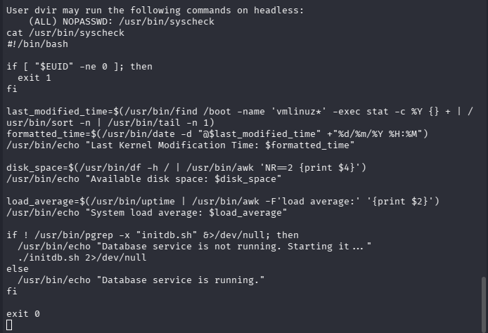
*Figure 24 - Every external command uses a full path except the relative ./initdb.sh call.*

That ./ means the script runs a file named initdb.sh from whatever directory you're currently in, not from a fixed location. That was the weakness we were looking for.

So we went to a writable directory inside /tmp and created our own initdb.sh with:

```bash
#!/bin/bash

/bin/bash
```

Then we made it executable using chmod +x and ran /usr/bin/syscheck, we had then successfully pwned the box.

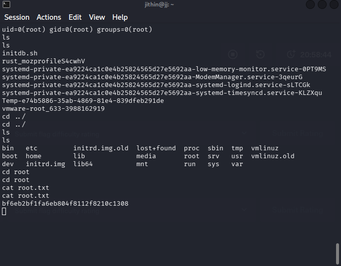
*Figure 25 - The fake initdb.sh runs as root, giving uid=0 and the root flag.*

**Answer:** `bf6eb2bf1fa6eb804f8112f8210c1308`

One thing I realised was that I had spent way too much time and things weren't working properly on our reverse shell as I didn't spawn an interactive shell, so this was something I had to do straight away for next time.
