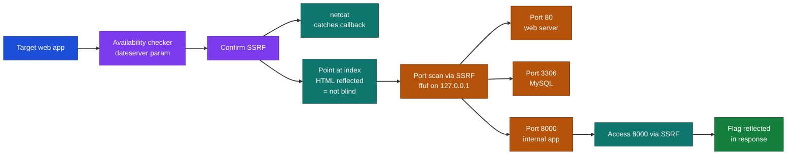
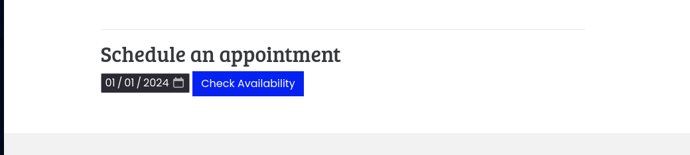
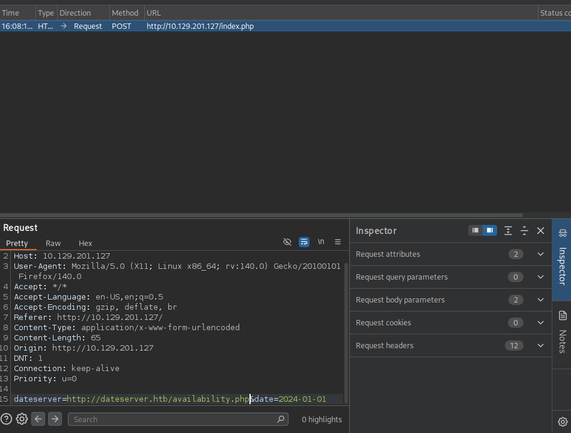
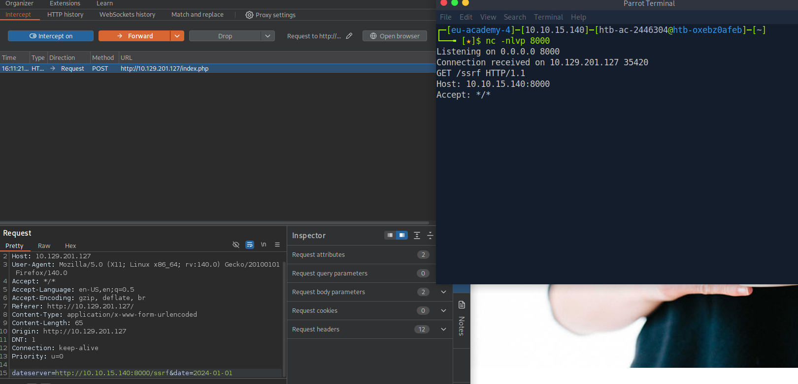
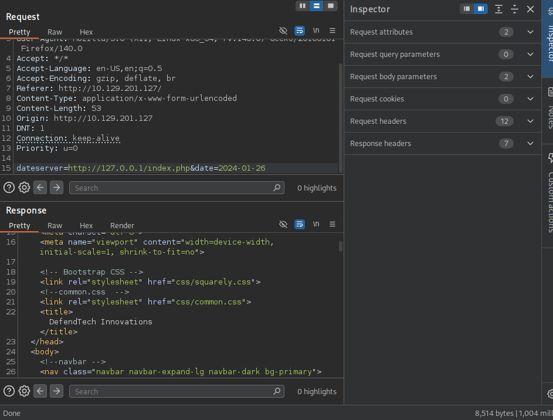
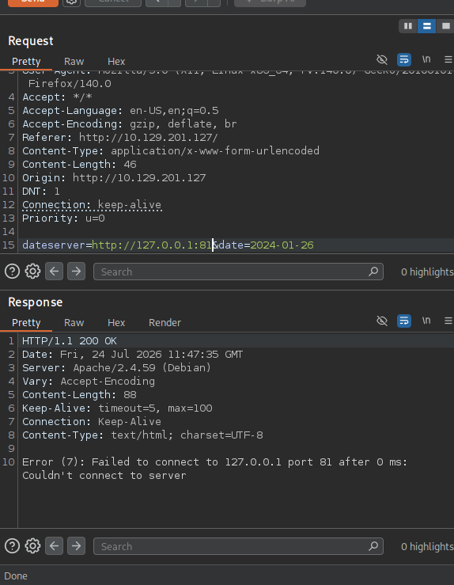
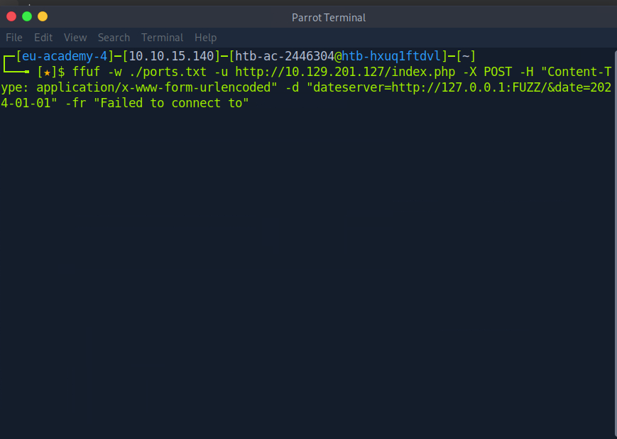
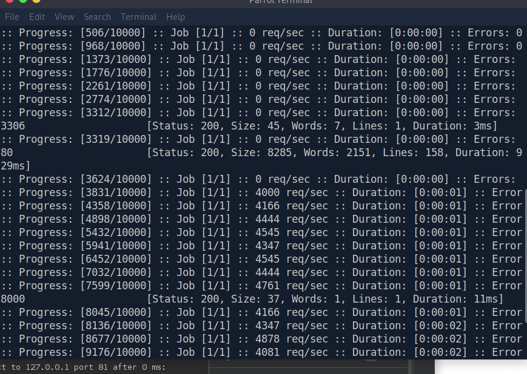
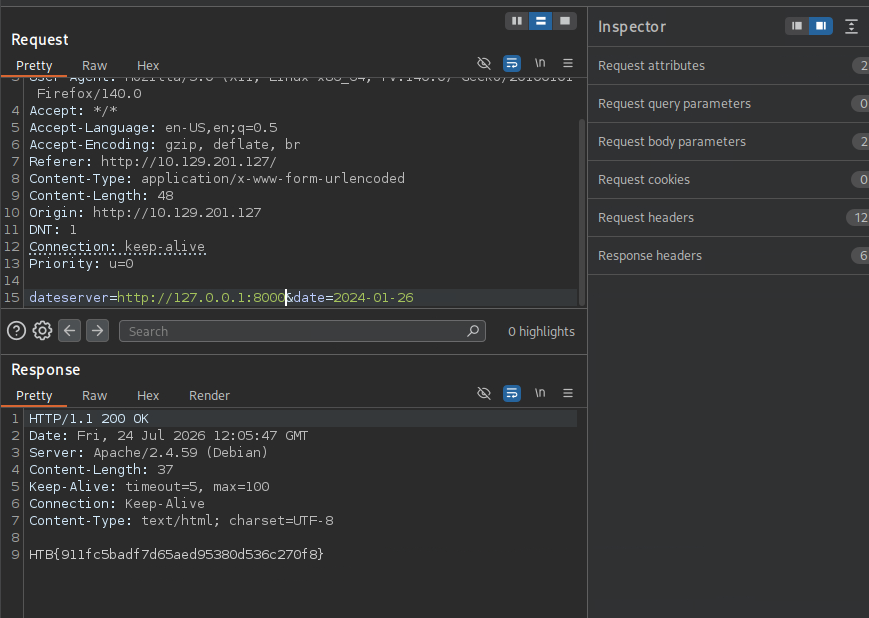

# Hack The Box Academy - In-Band SSRF (Skills Assessment) | Write-up

> **Platform:** Hack The Box Academy &nbsp;•&nbsp; **Category:** Server-side Attacks &nbsp;•&nbsp; **Difficulty:** Easy
>
> **Author:** Jithin Jelson

---

## Introduction

In this first exercise we are tasked with identifying an internal web application by exploiting an SSRF vulnerability and submitting the flag.

Target: `10.129.201.127`

---

## Assessment Overview

---

## What I Learned

- How to spot a likely SSRF by inspecting a request in Burp and finding a parameter that makes the server fetch a URL.
- Confirming an SSRF using a netcat listener to catch the server's outbound connection.
- Telling whether an SSRF is blind or not by pointing it at the app's own index and checking if the response is reflected back.
- Running an internal port scan through the SSRF with ffuf, using the closed-port error message as a filter.
- Why SSRF beats Nmap here, because the server can reach internal-only services behind the firewall that we cannot reach directly.
- That an internal service can trust requests coming from localhost, so abusing SSRF lets me send requests from the server's own trusted position.

---

## Visiting the Target

First we can visit our target.

*Figure 1 - The target web application homepage.*

The thing that stood out to me the most was the availability checker.

*Figure 2 - The appointment availability checker feature.*

There is a good chance this can be exploited using Burp, so we can fire it up.

---

## Confirming the SSRF

We can see that the `dateserver` parameter is sending a request to `availability.php`, which indicates the web server retrieves the availability information from a separate system specified by that URL. We can try to exploit this to fetch other content.

*Figure 3 - The dateserver parameter pointing at availability.php in Burp.*

We can confirm there is an SSRF, as I opened up netcat and caught the connection.

*Figure 4 - The netcat listener catching the inbound connection from the server, confirming SSRF.*

---

## Blind or Not Blind

Now we can test to see if the SSRF vulnerability is blind or not. To do this we can point it at its own index and see if the HTML page appears in the response.

*Figure 5 - Pointing the SSRF at 127.0.0.1/index.php reflects the app's own HTML back to us.*

It seems that the response reflected back the index page for us, so we can confirm the vulnerability is not blind.

---

## Enumerating the System

Now that we can confirm this, we can enumerate our system. We can first try a port that is most likely closed, we will use port 81.

*Figure 6 - The error message returned when a port is closed.*

We can see the message it gives us when the port is closed. We can use this message to tell ffuf to enumerate and which ports are closed with that message.

First we can create a wordlist from 1 to 10,000 using `seq 1 10000 > ports.txt`. Now we can use ffuf to enumerate our system.

*Figure 7 - The ffuf command used to scan internal ports through the SSRF.*

We are using the wordlist to enumerate our system, with the header telling our system it is in standard form, which we can copy from Burp. The `-d` is the data being sent to enumerate, and the `-fr` is the filter tag we use to filter by response text in order to only get the open ports.

*Figure 8 - The open ports returned by ffuf: 3306, 80 and 8000.*

The 3 ports we got were 3306, 80 and 8000.

Why do we use SSRF instead of Nmap was a question I initially had, but I came to an understanding that if you run an Nmap scan often times companies block all other ports other than port 80 and 443. Us being able to run from the server itself allows us to bypass this firewall and see the MySQL 3306 database, for example.

---

## Accessing the Internal Application

Now we can use our newfound knowledge to access this port using our server-side vulnerability.

*Figure 9 - Accessing the internal application on port 8000 through the SSRF, with the flag reflected back in the response.*

**Answer:** `HTB{5s7f_15_r3411y_c001!}`

From this I learned that the internal app is on 8000, and it does not accept outside connections. However, the internal app trusts requests coming from localhost. By abusing the SSRF I make the server send the request from its own trusted position, and since the internal app responds and it is not blind, the response gets reflected back to me.
