# Hack The Box Academy - Nessus Skills Assessment | Write-up

> **Platform:** Hack The Box Academy &nbsp;•&nbsp; **Category:** Vulnerability Assessment &nbsp;•&nbsp; **Tool:** Nessus
>
> **Author:** Jithin Jelson

---

This write-up is a vulnerability assessment in Hack The Box Academy using Nessus. In this exercise we have been tasked with performing an internal vulnerability assessment for the company Inlanefreight against one of their servers. The goal is to identify any significant vulnerabilities without carrying out a full-scale penetration test. The target server is a Windows server host which is used as a development server.

- **Target:** `172.16.16.100`
- **Credentials provided:** `administrator:Academy_VA_adm1!`
- **Nessus accessed at:** `https://10.129.202.116:8834`
- **Nessus credentials:** `htb-student:HTB_@cademy_student!`

---
## Assessment Overview

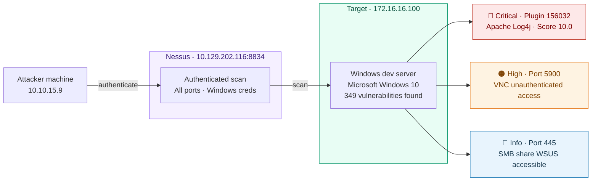

## Initial Reconnaissance

First lets ping the target to make sure we can complete this assessment.

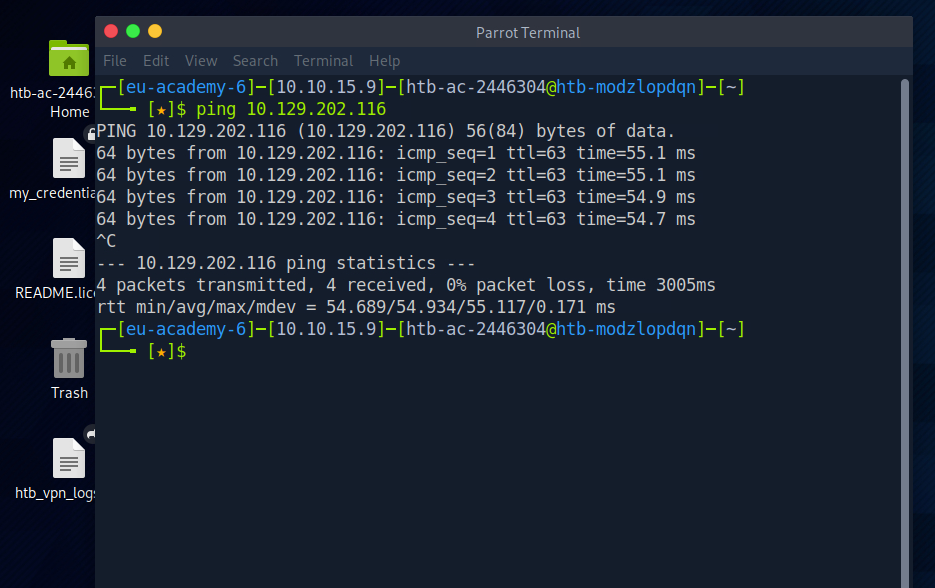
*Figure 1 - Verifying connectivity to the target*

Working as expected. Now we have verified that we can load up `https://10.129.202.116:8834` which will bring us to Nessus, and we can sign in using our credentials from earlier.

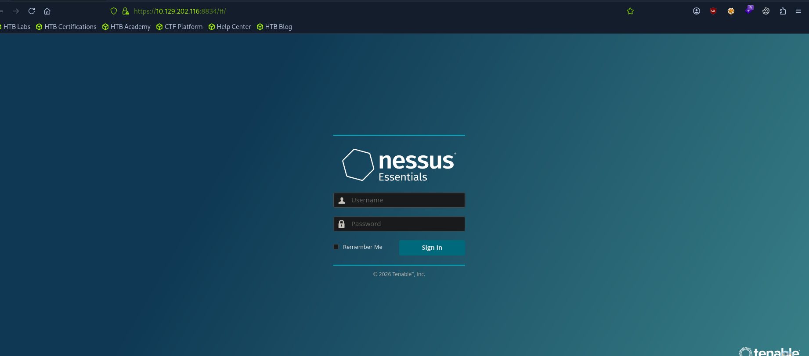
*Figure 2 - Signing in to the Nessus console*

---

## Setting Up the Scan

Then we have been tasked with performing a network scan against all ports against the target `172.16.16.100`. Additionally we have to set up the scan to be authenticated using the credentials provided.

Lets set up the scan and enter our target.

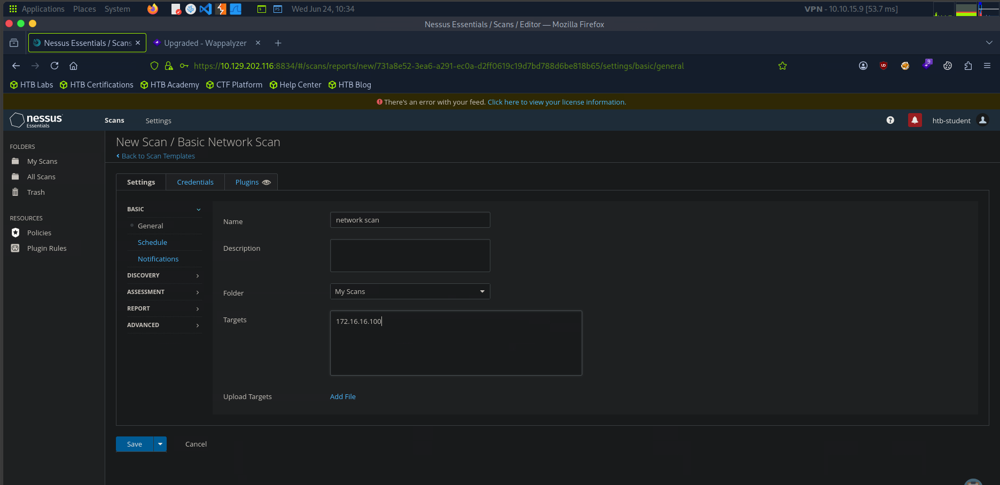
*Figure 3 - Configuring a Basic Network Scan against 172.16.16.100*

Under `Advanced > Windows` we can enter the admin credentials.

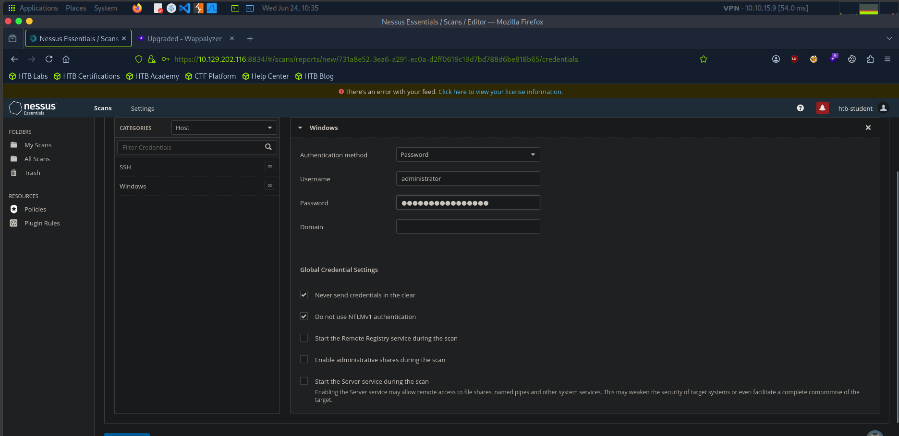
*Figure 4 - Adding the administrator credentials for an authenticated scan*

We can then save our scan and launch it from My Scans.

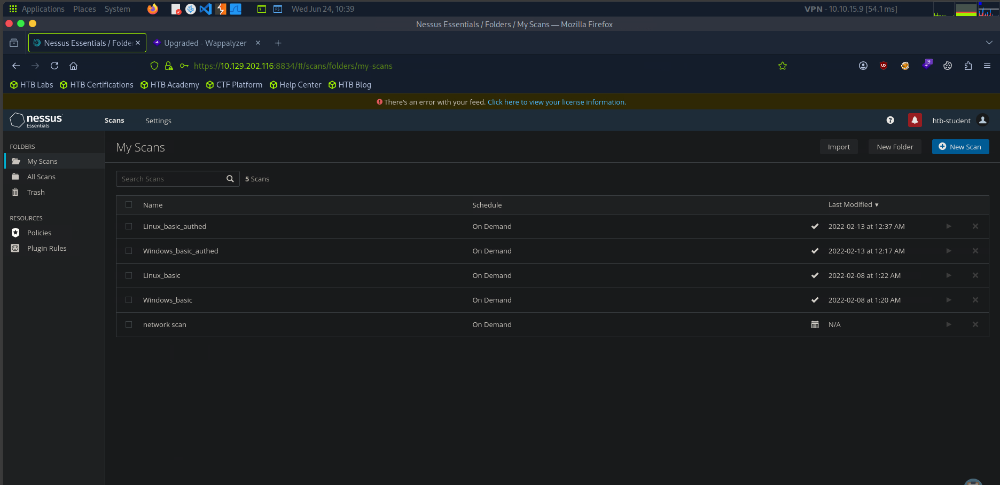
*Figure 5 - Launching the authenticated scan from My Scans*

> **Note:** due to the fact that the scan can take up to 60 minutes to complete, the assessment has provided us with a scan that has already been ran. We can use the results from this scan to answer the questions provided.

Now we have enough information to answer the questions provided to us for the assessment.

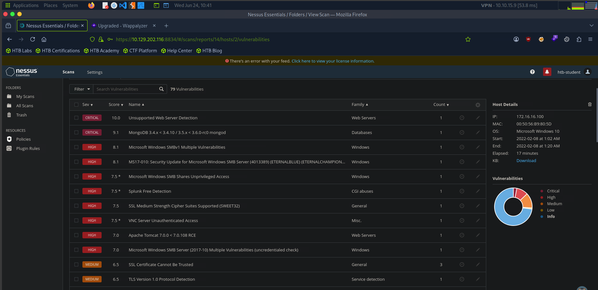
*Figure 6 - Reviewing the scan results for the target*

---

## Accessible SMB Shares

> What is the name of one of the accessible SMB shares from the authenticated Windows scan? (One word)

When we scroll down, we can see the option that we are looking for here.

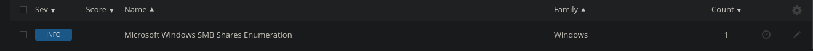
*Figure 7 - Microsoft Windows SMB Shares Enumeration*

We found the answer here.

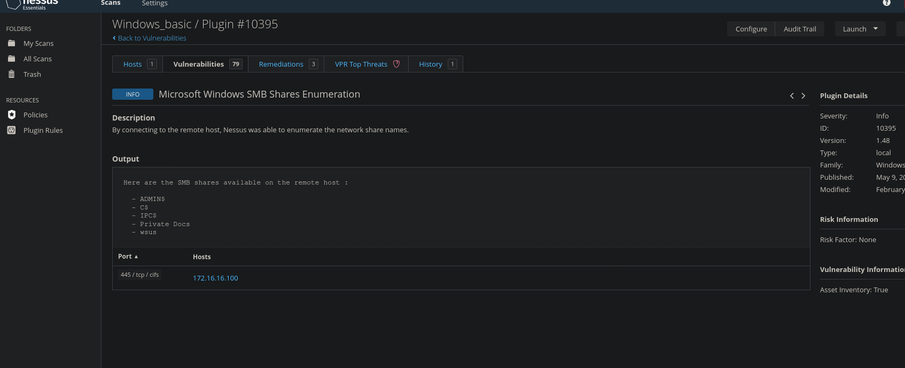
*Figure 8 - The available SMB shares, including the wsus share*

**Answer:** **WSUS**

---

## Scan Target

> What was the target for the authenticated scan?

We have this provided for us from the question itself.

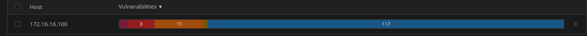
*Figure 9 - The target host 172.16.16.100*

**Answer:** `172.16.16.100`

---

## Highest Criticality Vulnerability

> What is the plugin ID of the highest criticality vulnerability for the Windows authenticated scan?

For this we have to go back and locate the required scan.

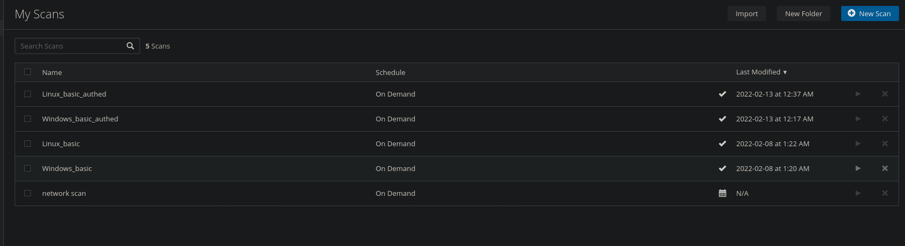
*Figure 10 - Locating the Windows authenticated scan*

When we hover over the highest critical vulnerability we can see the plugin ID.

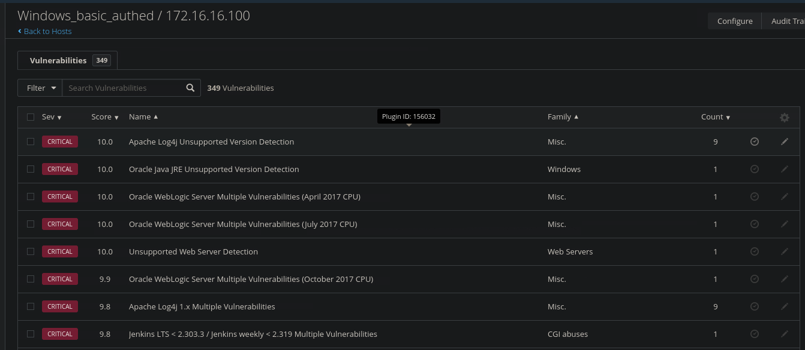
*Figure 11 - Plugin ID of the highest criticality vulnerability*

**Answer:** `156032`

---

## Identifying a Vulnerability by Plugin ID

> What is the name of the vulnerability with plugin ID 26925 from the Windows authenticated scan?

To get the vulnerability using the ID of a plugin, we can use the filter tab to change the filter type to Plugin ID and then search for it.

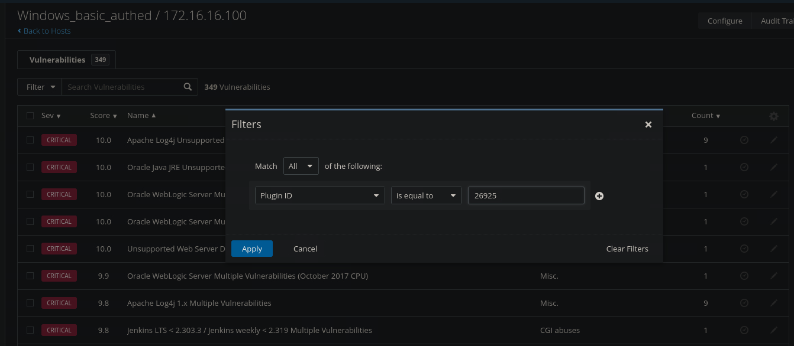
*Figure 12 - Filtering results by Plugin ID 26925*

We can then see the answer.

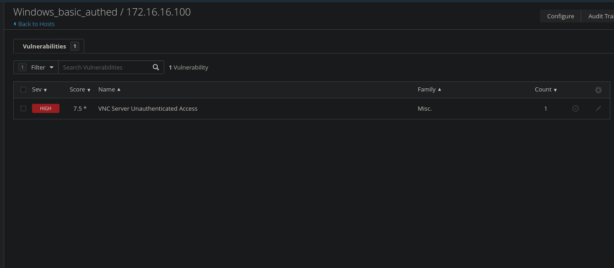
*Figure 13 - The vulnerability for Plugin ID 26925*

**Answer:** VNC Server Unauthenticated Access

---

## VNC Server Port

> What port is the VNC server running on in the authenticated Windows scan?

When we click on the vulnerability we can see the port number assigned to the VNC server running over TCP.

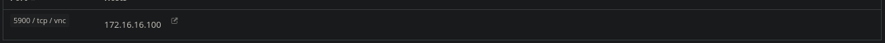
*Figure 14 - Port assigned to the VNC server*

**Answer:** `5900`

---

Write-up by <b>Jithin Jelson</b>
