# XSS - Cross Site Scripting

> **Category:** Web Application Penetration Testing &nbsp;•&nbsp; **Vulnerability:** Cross-Site Scripting (XSS) &nbsp;•&nbsp; **Author:** Jithin Jelson

In this assessment we are performing a web application penetration testing task for a company that has hired us, they have just released their security blog, in our web app penetration testing we have reached the part where we must test the web application against cross-site scripting vulnerabilities. The instructions we have been given is to identify a user input field that is vulnerable to an xss vulnerability in the assessment directory, find a working xss payload that executes javascript code on the targets browser and use session hijacking techniques to steal the victims cookies which contains the flag.

- **My IP:** `10.10.15.39`
- **Target IP:** `10.129.73.171`

---

## What I Learned

- That input sanitisation was stripping out the script tag and the ">" character
- That a comment waiting moderation meant I had to attempt a blind xss, as it was being carried out in a panel I don't have access to
- That netcat is not an actual web server, it just opens a raw connection and can't send back a proper response, so the browser never received my script.js
- That PHP's built in server with `php -S 0.0.0.0:8080` acts like a proper web server, so it can serve script.js and stay running to catch multiple requests

---
## Attack Overview
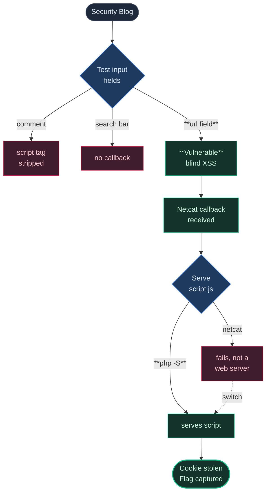

## Reconnaissance

Normally the first step would be to carry out an nmap scan but the assessment has already provided us with instructions on where we should find our vulnerability so we can go to that page.

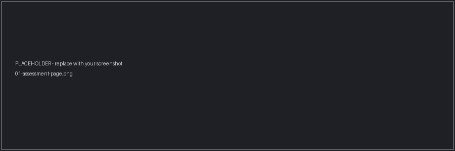
*Figure 1 - Navigating to the provided assessment page*

After a quick reconnaissance of our web page we came across a section we could leave a comment behind, this seems to be our best find so far.

*Figure 2 - Comment section identified as a potential injection point*

---

## Testing the Comment Field

After entering our initial payload of `` we find out that some input sanitisation is being taken place, we know this as I clicked on save my information and the input fields had changed my text.

*Figure 3 - Payload before submission*

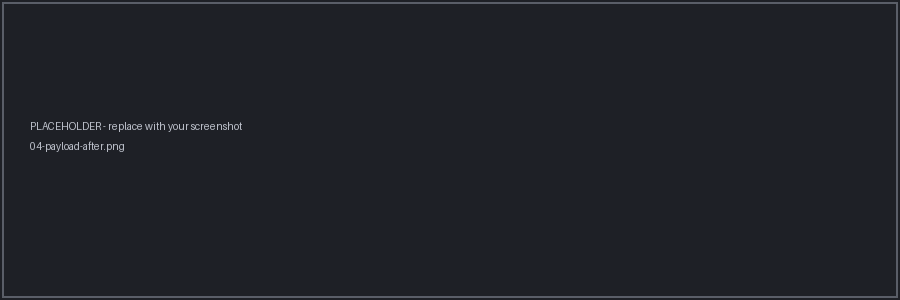
*Figure 4 - Payload stripped after submission*

It seems after closer inspection the script tag is being stripped out by input sanitisation, so we can test another payload instead using the github repo PayloadAllTheThings.

It seems to be that the only injection point is the comment field or username field as the url field has url field validation assigned to it.

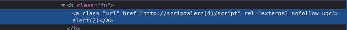
*Figure 5 - The url field has url validation assigned to it*

And the email field also has an email field validation assigned to it.

This was our next payload.

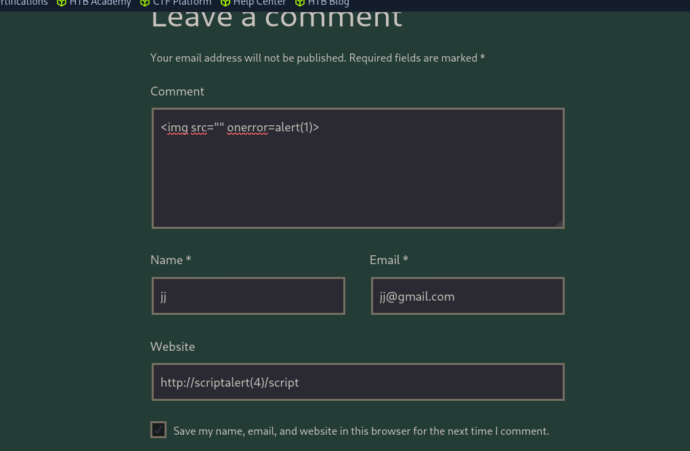
*Figure 6 - Second payload attempt using PayloadAllTheThings*

This time when I checked my comment there was nothing to be found.

*Figure 7 - Comment field empty after submission*

This was interesting, maybe this means the payload had worked, also it says comment is waiting moderation so maybe I had to attempt a blind xss? As the moderation was being carried out in maybe an admin panel or a panel we don't have access to?

---

## Attempting Blind XSS

So with these questions in mind I attempted a blind xss payload and I started up my netcat listener.

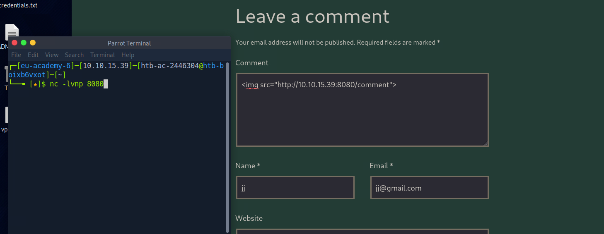
*Figure 8 - Starting netcat listener for blind XSS*

Unfortunately this was not a success, so my next step was to see how the input was handling my requests.

I attempted numerous payloads and none of them seemed to be a success so I started thinking, the url field still allows me to enter a malicious payload but it gets reworded later on into url format, maybe we can try and bypass this?

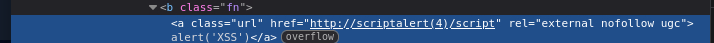
*Figure 9 - Attempting to bypass url field reformatting*

But with no success, it seems to be that the ">" is being stripped and we can't put that in our final message.

Then when I scrolled down a bit I found a search bar, maybe this was an injection point.

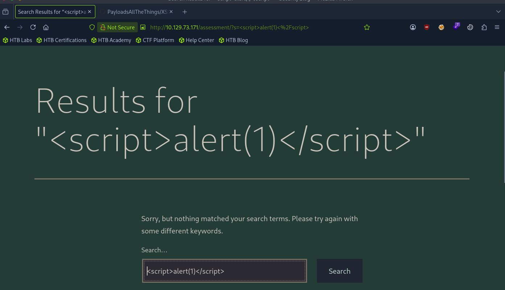
*Figure 10 - Search bar identified as a possible injection point*

Seems like there is no input sanitisation on the search bar, this one seems to look promising, so I modified my payload slightly.

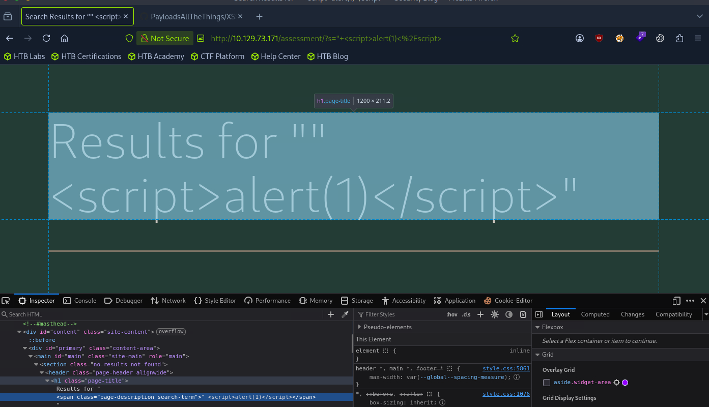
*Figure 11 - Modified payload tested in the search bar*

The field seems to be in a span tag, lets try and close the span tag and then execute our payload.

At this point I was stuck and I didn't know what to do so I reached out for the hint on hackthebox and it said you can't see me but I can see you, which indicated that we are looking for a blind xss.

And finally we got a response from our netcat in the url field after trying out numerous payloads.

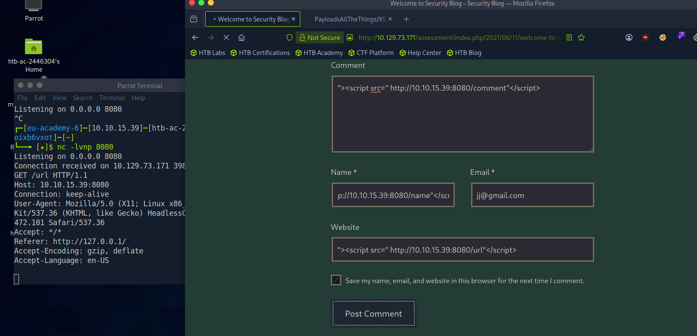
*Figure 12 - Response received on netcat listener from url field*

---

## Session Hijacking

Now its time to inject our vulnerability and obtain the flag, since we have only been asked to get the cookie we will write a simple script in which we can get the cookie details and name it script.js.

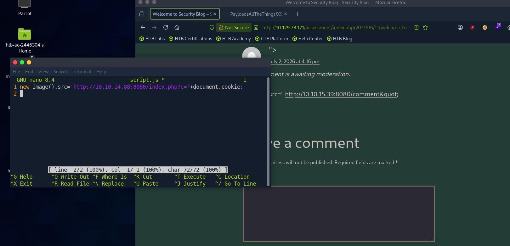
*Figure 13 - Writing script.js to capture cookie details*

I used a netcat listener at this point and after some troubleshooting I found out that it doesn't work, and when I researched it I found out that netcat is not an actual web server, it just opens a raw connection and shows you whatever comes through it. It doesn't know how to send back a proper response, so when the browser requested my script.js file it never actually received anything back, meaning the script never ran and the cookie was never sent anywhere.

Because of this I switched over to using PHP's built in server instead with `php -S 0.0.0.0:8080`, since this actually acts like a proper web server, it can serve my script.js file correctly and stays running to catch multiple requests, which is what I needed to both serve the script and capture the cookie.

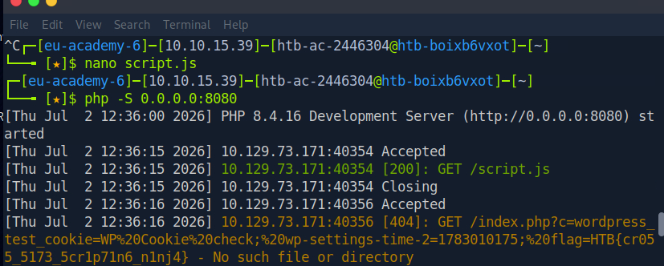
*Figure 14 - Successfully capturing the victims cookie*

Then we successfully got the cookie.

---

Write-up by Jithin Jelson
